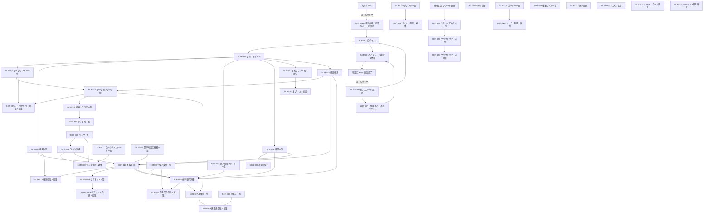
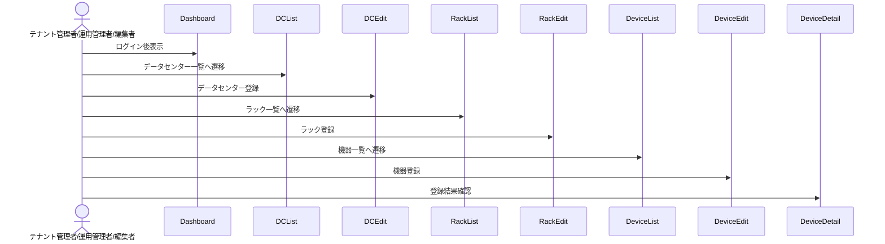
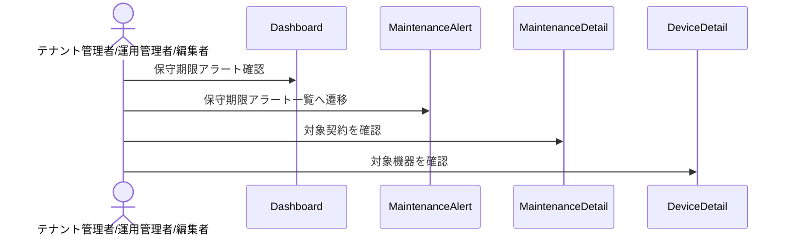
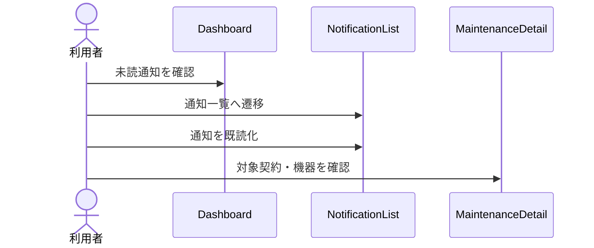
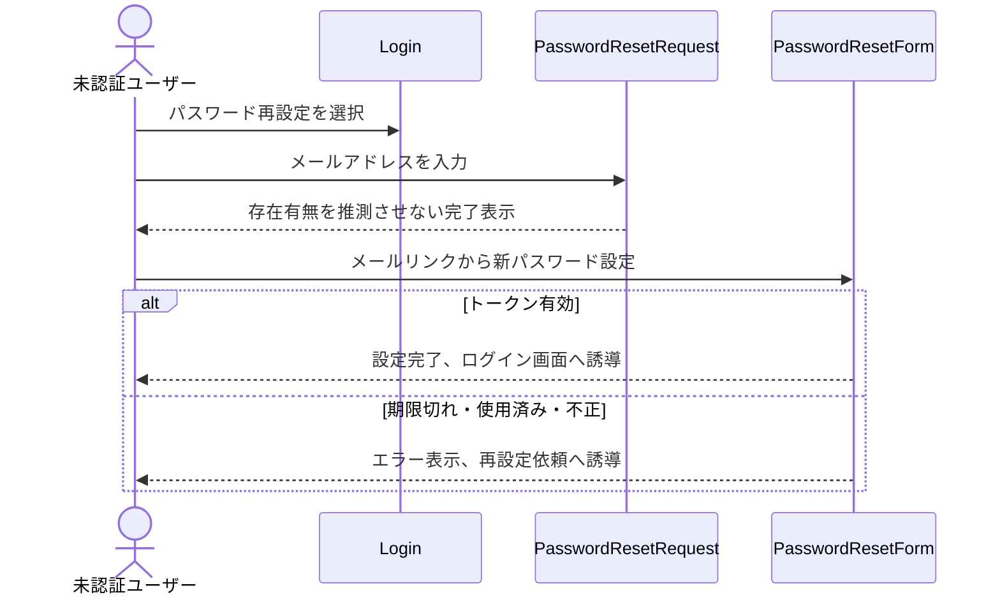
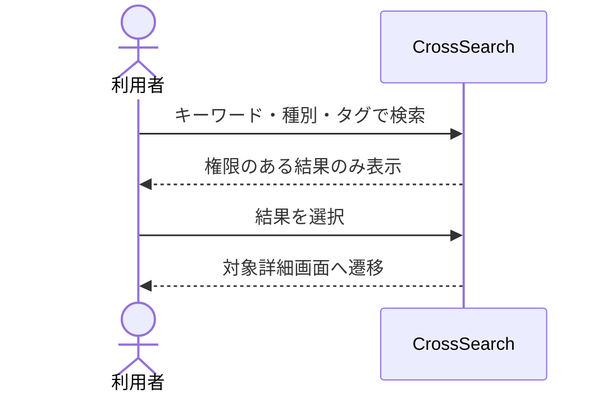
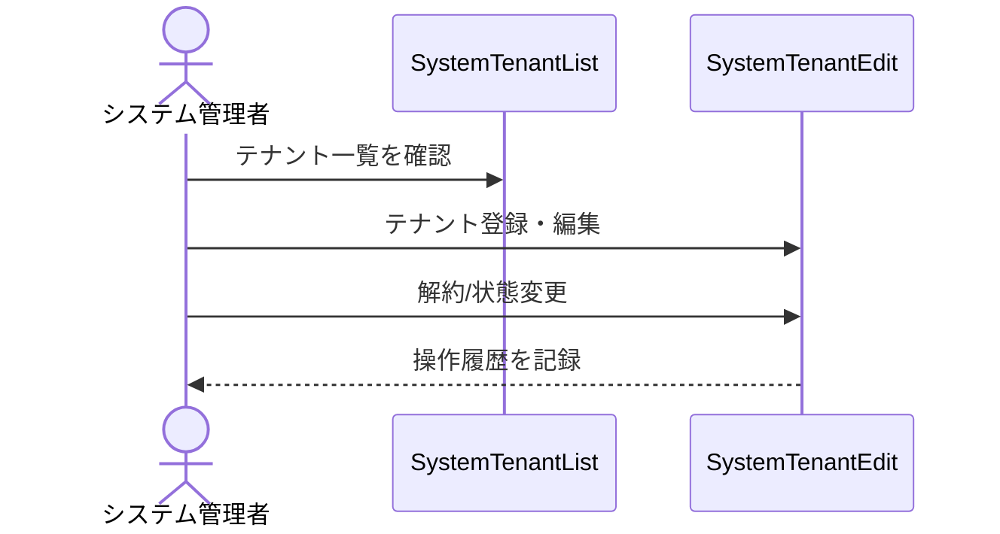
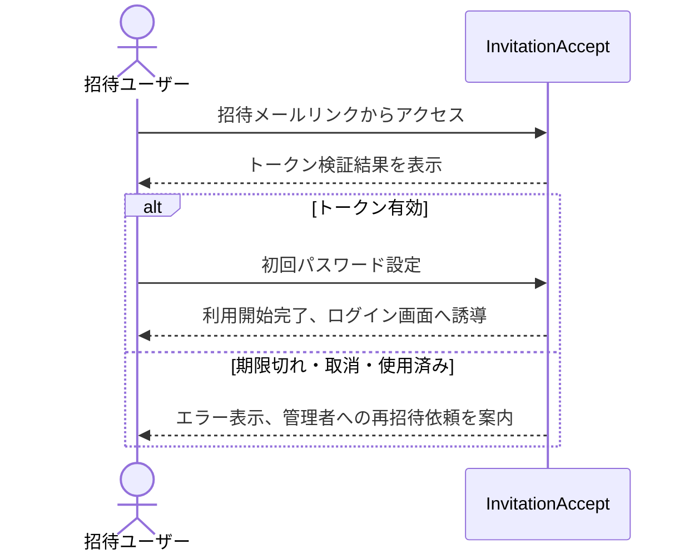

# 画面遷移

## 1. 目的

本書は、Data Center Asset & Infrastructure Manager の主要画面遷移を定義する。

## 2. 全体方針

- ログイン後はダッシュボードへ遷移する。
- 左サイドメニューから主要機能へ遷移する。
- 各一覧画面から詳細画面、登録・編集画面へ遷移する。
- 詳細画面から関連情報へ遷移できるようにする。
- 削除は原則として一覧または詳細画面から確認ダイアログを経由して実行する。

## 3. 主要画面遷移図



## 4. メニュー構成

| メニュー | 遷移先 | 備考 |
|---|---|---|
| パスワード再設定 | SCR-001A〜SCR-001B | ログイン画面から遷移。メールリンク経由で新パスワード設定へ進む |
| 招待承諾 | SCR-001C | 招待メールリンクから遷移。初回パスワード設定後にログインへ誘導する |
| テナント管理 | SCR-039〜SCR-040 | システム管理者専用。テナント登録・編集・解約を行う |
| 横断検索 | SCR-041 | キーワード、別名、タグから主要リソースを横断検索する |
| ダッシュボード | SCR-002 | ログイン後の初期画面 |
| データセンター | SCR-003 | DC、建物、フロア、エリア管理の入口。フロア図はグリッド表示を基本とする |
| ラック | SCR-008 | ラック管理の入口。ラック詳細ではU単位グリッドで搭載状態を表示する |
| ラックテンプレート | SCR-011 | ラックテンプレート管理、テンプレートからラック作成 |
| 機器 | SCR-012 | サーバー/NW機器管理の入口 |
| IPサブネット | SCR-015 | IPサブネット・IP利用状況管理の入口 |
| 保守契約 | SCR-017 | 保守契約管理の入口 |
| 保守未設定 | SCR-020 | 保守契約未設定機器の確認 |
| 保守期限アラート | SCR-021 | 期限切れ/期限間近契約の確認 |
| 将来拡張：クラウド | SCR-022 | クラウドアカウント・リソース管理 |
| タグ管理 | SCR-025 | 共通タグ管理 |
| 通知設定 | SCR-026 | 通知条件・通知先管理 |
| 通知一覧 | SCR-036 | 未読通知確認、通知詳細、既読化 |
| ユーザー管理 | SCR-027 | ユーザー・ロール管理 |
| 契約プラン | SCR-030 | 利用状況・オプション管理 |
| 操作履歴 | SCR-032 | 初期必須の操作履歴検索・閲覧。変更差分履歴は将来拡張 |
| システム設定 | SCR-033 | テナント設定 |
| CSVインポート | SCR-034 | 初期追加対象。初期リリースでは非表示または無効化 |
| リージョン管理 | SCR-035 | 地域・都道府県分類の管理 |
| 連絡先管理 | SCR-037〜SCR-038 | DC・保守契約に紐づく連絡先の管理 |

## 5. 代表的な業務遷移

### 5.1 データセンター・ラック・機器登録



### 5.2 保守期限確認



### 5.3 画面内通知確認



### 5.4 プラン上限確認とオプション追加

```mermaid
sequenceDiagram
    actor Billing as 管理者/契約管理者
    Billing->>Usage: 契約プラン・利用状況確認
    Billing->>Option: オプション追加画面へ遷移
    Billing->>Option: オプション追加を申請
    Billing->>Usage: 申請状態を確認
```

### 5.5 パスワード再設定


### 5.6 横断検索



### 5.7 テナント管理




### 5.8 ユーザー招待承諾



## 6. 遷移制御

| 条件 | 制御内容 |
|---|---|
| 未ログイン | ログイン画面へリダイレクト |
| 権限不足 | 403相当の権限エラー画面またはメッセージ表示 |
| プラン上限到達 | 登録不可、またはオプション追加画面への導線を表示 |
| 対象データなし | 一覧へ戻す、またはデータ不存在メッセージ表示 |
| テナント不一致 | アクセス拒否 |
