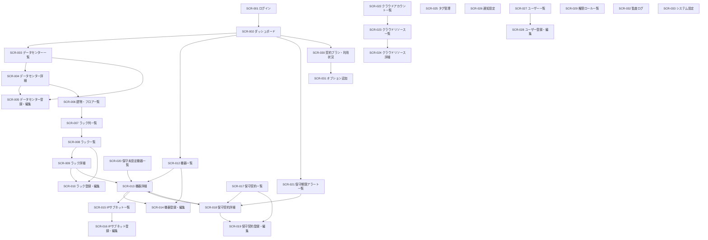
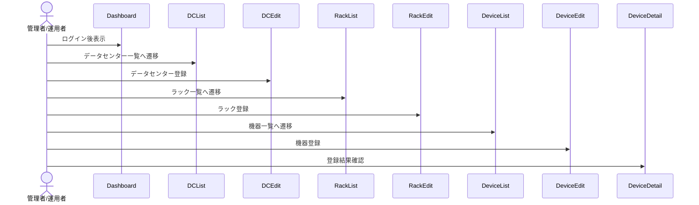
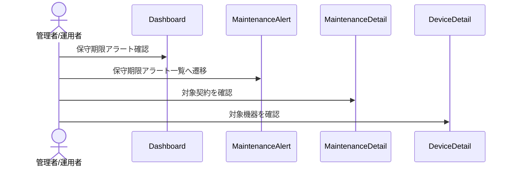

# 画面遷移

## 1. 目的

本書は、Data Center Asset & Infrastructure Manager の主要画面遷移を定義する。

## 2. 全体方針

- ログイン後はダッシュボードへ遷移する。
- 左サイドメニューから主要機能へ遷移する。
- 各一覧画面から詳細画面、登録・編集画面へ遷移する。
- 詳細画面から関連情報へ遷移できるようにする。
- 削除は原則として一覧または詳細画面から確認ダイアログを経由して実行する。

## 3. 主要画面遷移図



## 4. メニュー構成

| メニュー | 遷移先 | 備考 |
|---|---|---|
| ダッシュボード | SCR-002 | ログイン後の初期画面 |
| データセンター | SCR-003 | DC、建物、フロア、エリア管理の入口 |
| ラック | SCR-008 | ラック管理の入口 |
| 機器 | SCR-012 | サーバー/NW機器管理の入口 |
| IPサブネット | SCR-015 | IPサブネット・IP利用状況管理の入口 |
| 保守契約 | SCR-017 | 保守契約管理の入口 |
| 保守未設定 | SCR-020 | 保守契約未設定機器の確認 |
| 保守期限アラート | SCR-021 | 期限切れ/期限間近契約の確認 |
| クラウド | SCR-022 | クラウドアカウント・リソース管理 |
| タグ管理 | SCR-025 | 共通タグ管理 |
| 通知設定 | SCR-026 | 通知条件・通知先管理 |
| ユーザー管理 | SCR-027 | ユーザー・ロール管理 |
| 契約プラン | SCR-030 | 利用状況・オプション管理 |
| 監査ログ | SCR-032 | 操作履歴確認 |
| システム設定 | SCR-033 | テナント設定 |

## 5. 代表的な業務遷移

### 5.1 データセンター・ラック・機器登録



### 5.2 保守期限確認



### 5.3 プラン上限確認とオプション追加

```mermaid
sequenceDiagram
    actor Admin as 管理者
    Admin->>Usage: 契約プラン・利用状況確認
    Admin->>Option: オプション追加画面へ遷移
    Admin->>Usage: 追加後の上限を確認
```

## 6. 遷移制御

| 条件 | 制御内容 |
|---|---|
| 未ログイン | ログイン画面へリダイレクト |
| 権限不足 | 403相当の権限エラー画面またはメッセージ表示 |
| プラン上限到達 | 登録不可、またはオプション追加画面への導線を表示 |
| 対象データなし | 一覧へ戻す、またはデータ不存在メッセージ表示 |
| テナント不一致 | アクセス拒否 |
