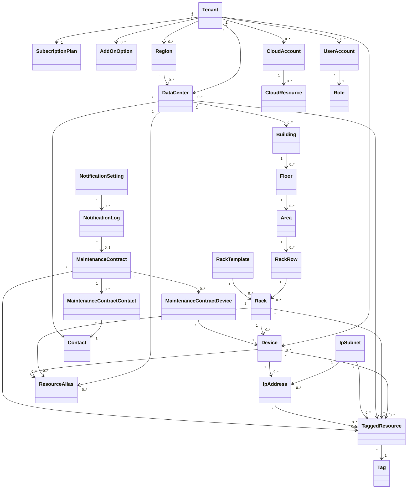

# ドメインモデル

## 1. 目的

本書は、Data Center Asset & Infrastructure Manager の基本設計におけるドメインモデルを定義する。

開発方針は、Java / Spring Boot / Vaadin / MariaDB を前提とし、DDDを意識したドメイン分割を行う。

## 2. 境界づけられたコンテキスト

| コンテキスト | 概要 | 主な集約 |
|---|---|---|
| テナント・契約管理 | SaaSテナント、契約プラン、利用上限、オプションを管理する | Tenant、SubscriptionPlan、UsageLimit、AddOnOption |
| ロケーション管理 | リージョン、データセンター、建物、フロア、エリア、ラック列を管理する | Region、DataCenter、Building、Floor、Area、RackRow |
| ラック管理 | ラックとラック内搭載位置を管理する | Rack、RackMountPosition、RackTemplate |
| 機器管理 | サーバー、ネットワーク機器、呼称名・別名、タグを管理する | Device、ResourceAlias、Tag |
| IPサブネット管理 | IPサブネットと配下IPの割当状況を管理する | IpSubnet、IpAddress |
| 保守契約管理 | 保守契約、対象機器、連絡先、期限通知を管理する | MaintenanceContract、MaintenanceContractDevice、MaintenanceContractContact、MaintenanceAlert |
| 将来拡張：クラウドリソース管理 | AWSアカウント、リージョン、EC2/EKS/コンテナ等を管理する | CloudAccount、CloudResource |
| ユーザー・権限管理 | ユーザー、ロール、権限を管理する | UserAccount、Role、Permission |
| 通知管理 | メール/画面内通知条件、通知先、通知履歴、未読/既読を管理する | NotificationSetting、NotificationLog |
| 将来拡張：監査ログ管理 | 操作履歴を管理する | AuditLog |

## 3. 主要エンティティ

ID型は初期リリースでは詳細設計・DB設計に合わせて `Long`（DB上は `bigint`）を採用する。UUIDは将来、外部公開IDや分散構成が必要になった場合に再検討する。

### 3.1 Tenant

| 属性 | 型 | 説明 |
|---|---|---|
| tenantId | Long | テナントID |
| name | String | テナント名 |
| planType | Enum | Free / Starter / Business / Enterprise |
| status | Enum | Active / Suspended / TrialExpired / Cancelled |
| trialStartDate | Date | Freeトライアル開始日。Free以外はnull可 |
| trialEndDate | Date | Freeトライアル終了日。Free以外はnull可 |
| createdAt | DateTime | 作成日時 |
| updatedAt | DateTime | 更新日時 |

### 3.2 SubscriptionPlan

| 属性 | 型 | 説明 |
|---|---|---|
| planId | Long | プランID |
| planType | Enum | プラン種別 |
| maxDataCenters | Integer | DC上限 |
| maxRacks | Integer | ラック上限 |
| maxDevices | Integer | 機器上限 |
| maxIpAddresses | Integer | 管理対象IP数上限 |
| maxTags | Integer | タグマスタ件数上限 |
| trialDays | Integer | Freeトライアル日数 |
| maxUsers | Integer | ユーザー上限 |

### 3.3 Region

| 属性 | 型 | 説明 |
|---|---|---|
| regionId | Long | リージョンID |
| tenantId | Long | テナントID |
| regionName | String | 地域名 |
| prefecture | String | 都道府県 |
| displayOrder | Integer | 表示順 |
| status | Enum | Active / Inactive |

### 3.4 DataCenter

| 属性 | 型 | 説明 |
|---|---|---|
| dataCenterId | Long | データセンターID |
| tenantId | Long | テナントID |
| officialName | String | 正式名称 |
| displayName | String | 代表表示名。複数の呼称名・別名はResourceAliasで保持 |
| regionId | Long | 地域・都道府県分類ID。`Region` を参照 |
| address | String | 所在地 |
| status | Enum | Active / Inactive |

### 3.5 Location階層

| エンティティ | 説明 |
|---|---|
| Building | データセンター内の建物・棟 |
| Floor | 建物内のフロア |
| Area | フロア内のエリア。東/西/南/北など |
| RackRow | エリア内のラック列 |
| Rack | ラック列内のラック |

### 3.6 Rack

| 属性 | 型 | 説明 |
|---|---|---|
| rackId | Long | ラックID |
| rackRowId | Long | ラック列ID |
| officialName | String | 正式名称 |
| displayName | String | 代表表示名。複数の呼称名・別名はResourceAliasで保持 |
| heightU | Integer | ラック高さU数 |
| positionNo | String | ラック列内位置 |
| status | Enum | ACTIVE / INACTIVE |

### 3.6A RackTemplate

| 属性 | 型 | 説明 |
|---|---|---|
| rackTemplateId | Long | ラックテンプレートID |
| tenantId | Long | テナントID |
| templateName | String | テンプレート名 |
| heightU | Integer | ラック高さU数 |
| category | String | 用途・カテゴリ |
| active | Boolean | 有効フラグ |
| note | String | 備考 |
| templateItems | List | 標準搭載構成・予約U範囲。作成時コピーとしてラックへ反映 |

### 3.7 Device

| 属性 | 型 | 説明 |
|---|---|---|
| deviceId | Long | 機器ID |
| tenantId | Long | テナントID |
| rackId | Long | 設置ラックID |
| officialName | String | 正式名称 |
| displayName | String | 代表表示名。複数の呼称名・別名はResourceAliasで保持 |
| deviceType | Enum | Server / Switch / Router / Firewall / LoadBalancer / Other |
| vendor | String | ベンダー |
| modelName | String | 型番 |
| serialNumber | String | シリアル番号 |
| rackStartU | Integer | 搭載開始U |
| rackSizeU | Integer | 搭載U数 |
| lifecycleStatus | Enum | ACTIVE / SPARE / PLANNED_RETIREMENT / RETIRED |

### 3.8 IpSubnet / IpAddress

| 属性 | 型 | 説明 |
|---|---|---|
| ipSubnetId | Long | IPサブネットID |
| tenantId | Long | テナントID |
| cidr | String | CIDR表記 |
| name | String | サブネット名 |
| status | Enum | ACTIVE / RESERVED / RETIRED |
| ipAddressId | Long | 個別IP利用状況ID |
| address | String | IPアドレス |
| assignedDeviceId | Long | 割当機器ID |
| purpose | String | 用途 |
| usageStatus | Enum | UNUSED / IN_USE / RESERVED / RETIRED |

### 3.9 MaintenanceContract

| 属性 | 型 | 説明 |
|---|---|---|
| maintenanceContractId | Long | 保守契約ID |
| tenantId | Long | テナントID |
| contractName | String | 契約名 |
| vendorName | String | ベンダー名 |
| contractNo | String | 契約番号 |
| startDate | Date | 開始日 |
| endDate | Date | 終了日 |
| notificationEnabled | Boolean | 通知有効フラグ |
| notificationDaysBefore | Integer | 主通知日数。標準60日。30日前・当日・期限切れは通知設定/バッチ条件で扱う |

### 3.10 CloudResource（将来拡張）

| 属性 | 型 | 説明 |
|---|---|---|
| cloudResourceId | Long | クラウドリソースID |
| cloudAccountId | Long | クラウドアカウントID |
| resourceType | Enum | EC2 / Container / EksCluster / EksPod / Other |
| resourceName | String | リソース名 |
| region | String | リージョン |
| externalResourceId | String | クラウド側ID |
| status | String | クラウド側状態 |

### 3.11 共通監査情報

主要エンティティは、最低限の監査情報として以下を保持する。

| 属性 | 型 | 説明 |
|---|---|---|
| createdBy | Long | 作成者 |
| createdAt | DateTime | 作成日時 |
| updatedBy | Long | 更新者 |
| updatedAt | DateTime | 更新日時 |

完全な操作履歴・変更履歴は将来拡張の監査ログ管理で扱う。

### 3.12 連絡先・タグ・通知・CSV関連

| エンティティ | 説明 |
|---|---|
| Contact | データセンターや保守契約に紐づく連絡先 |
| ResourceAlias | データセンター、ラック、機器など対象リソースの呼称名・別名 |
| Tag | 検索・分類用タグ |
| TaggedResource | タグと対象リソースの関連 |
| NotificationSetting | 通知条件、通知先、通知チャネル設定 |
| NotificationLog | 画面内通知・メール通知の履歴 |
| CsvImportHistory | CSV取込履歴 |
| CsvImportError | CSV取込時の行単位エラー |
| MaintenanceContractDevice | 保守契約と対象機器の関連 |
| MaintenanceContractContact | 保守契約と連絡先の関連 |

## 4. 値オブジェクト候補

| 値オブジェクト | 説明 |
|---|---|
| TenantId | テナント識別子 |
| DataCenterId | データセンター識別子 |
| RackPosition | ラック内U位置 |
| IpSubnetCidr | IPサブネットCIDR
| IpAddressValue | IPアドレス値 |
| ContactInfo | メール・電話番号 |
| DateRange | 開始日・終了日の期間 |
| UsageLimit | 契約プラン上限 |
| AliasName | 別名・呼称名 |

## 5. 集約と関連

## 6. ドメインサービス候補

| サービス | 役割 |
|---|---|
| UsageLimitService | プラン別上限チェック、オプション加算後の上限算出 |
| RackPlacementService | ラック搭載位置の重複チェック、空きU計算 |
| IpAllocationService | IPアドレス割当、解放、重複チェック |
| MaintenanceAlertService | 保守期限2か月前通知対象の抽出 |
| DeviceSearchService | 保守未設定機器、タグ、別名、設置場所による検索 |
| ResourceAliasService | 対象リソースの呼称名・別名の登録、重複確認、検索 |
| CloudResourceSyncService | 将来拡張。クラウドリソースの同期方針管理 |
| AuthorizationService | ロール・権限による操作可否判定 |

## 7. ドメイン制約

| 制約ID | 制約内容 |
|---|---|
| DRC-001 | すべての主要データはtenantIdで分離する |
| DRC-002 | 契約プラン上限を超えてDC、ラック、機器、管理対象IP、タグ、ユーザーを登録できない |
| DRC-003 | Freeプランは14日間トライアルとし、DC 1件、ラック3本、機器40台、管理対象IP 256件、タグ10件、ユーザー3名まで。IPサブネット数には上限を設けない |
| DRC-003-1 | Freeトライアル期限超過後は `TRIAL_EXPIRED` として扱い、ログイン・参照・CSVエクスポート・有料プラン変更のみ許可する |
| DRC-004 | 管理対象IP数上限と機器台数はオプションで追加できる |
| DRC-005 | IP上限追加は256IP単位とする |
| DRC-006 | 機器追加は100台単位とする |
| DRC-007 | ラック内のU位置は同一ラック内で重複不可とする |
| DRC-007-1 | ラックテンプレートの標準搭載構成・予約U範囲もU重複不可とし、ラック作成時コピーを基本とする |
| DRC-008 | 保守契約には複数の機器をひもづけ可能とする |
| DRC-009 | 保守契約未設定の機器を検索可能とする |
| DRC-010 | 保守期限通知は60日前、30日前、当日、期限切れを初期対象とし、通知ログでチャネル・受信者単位に重複抑止する |
| DRC-011 | 正式名称とは別に表示名・別名を持てる |
| DRC-012 | 主要エンティティにタグを付与できる。初期対象はDataCenter、Rack、Device、IpSubnet、IpAddress、MaintenanceContractとし、CloudResourceは将来拡張対象とする |
| DRC-013 | タグ数上限は有効なタグマスタ件数で判定し、リソースへのタグ付け件数は対象外とする |
