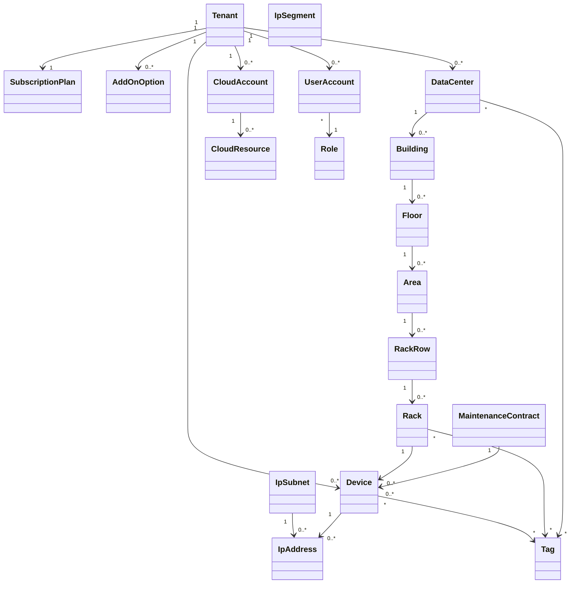

# ドメインモデル

## 1. 目的

本書は、Data Center Asset & Infrastructure Manager の基本設計におけるドメインモデルを定義する。

開発方針は、Java / Spring Boot / Vaadin / MariaDB を前提とし、DDDを意識したドメイン分割を行う。

## 2. 境界づけられたコンテキスト

| コンテキスト | 概要 | 主な集約 |
|---|---|---|
| テナント・契約管理 | SaaSテナント、契約プラン、利用上限、オプションを管理する | Tenant、SubscriptionPlan、UsageLimit、AddOnOption |
| ロケーション管理 | データセンター、建物、フロア、エリア、ラック列を管理する | DataCenter、Building、Floor、Area、RackRow |
| ラック管理 | ラックとラック内搭載位置を管理する | Rack、RackMountPosition、RackTemplate |
| 機器管理 | サーバー、ネットワーク機器、別名、タグを管理する | Device、DeviceAlias、Tag |
| IPサブネット管理 | IPサブネットと配下IPの割当状況を管理する | IpSubnet、IpAddress |
| 保守契約管理 | 保守契約、対象機器、期限通知を管理する | MaintenanceContract、MaintenanceContractDevice、MaintenanceAlert |
| クラウドリソース管理 | AWSアカウント、リージョン、EC2/EKS/コンテナ等を管理する | CloudAccount、CloudResource |
| ユーザー・権限管理 | ユーザー、ロール、権限を管理する | UserAccount、Role、Permission |
| 通知管理 | メール通知条件、通知先、通知履歴を管理する | NotificationSetting、NotificationHistory |
| 監査ログ管理 | 操作履歴を管理する | AuditLog |

## 3. 主要エンティティ

### 3.1 Tenant

| 属性 | 型 | 説明 |
|---|---|---|
| tenantId | UUID | テナントID |
| name | String | テナント名 |
| planType | Enum | Free / Starter / Business / Enterprise |
| status | Enum | Active / Suspended / Cancelled |
| createdAt | DateTime | 作成日時 |
| updatedAt | DateTime | 更新日時 |

### 3.2 SubscriptionPlan

| 属性 | 型 | 説明 |
|---|---|---|
| planId | UUID | プランID |
| planType | Enum | プラン種別 |
| maxDataCenters | Integer | DC上限 |
| maxRackRows | Integer | ラック列上限 |
| maxDevices | Integer | 機器上限 |
| maxIpSubnets | Integer | IPサブネット上限 |
| maxUsers | Integer | ユーザー上限 |

### 3.3 DataCenter

| 属性 | 型 | 説明 |
|---|---|---|
| dataCenterId | UUID | データセンターID |
| tenantId | UUID | テナントID |
| officialName | String | 正式名称 |
| displayName | String | 表示名 |
| region | String | 地域 |
| prefecture | String | 都道府県 |
| address | String | 所在地 |
| contactEmail | String | 連絡先メール |
| contactPhone | String | 連絡先電話番号 |
| status | Enum | Active / Inactive |

### 3.4 Location階層

| エンティティ | 説明 |
|---|---|
| Building | データセンター内の建物・棟 |
| Floor | 建物内のフロア |
| Area | フロア内のエリア。東/西/南/北など |
| RackRow | エリア内のラック列 |
| Rack | ラック列内のラック |

### 3.5 Rack

| 属性 | 型 | 説明 |
|---|---|---|
| rackId | UUID | ラックID |
| rackRowId | UUID | ラック列ID |
| officialName | String | 正式名称 |
| displayName | String | 表示名 |
| heightU | Integer | ラック高さU数 |
| positionNo | String | ラック列内位置 |
| status | Enum | Active / Reserved / Retired |

### 3.6 Device

| 属性 | 型 | 説明 |
|---|---|---|
| deviceId | UUID | 機器ID |
| tenantId | UUID | テナントID |
| rackId | UUID | 設置ラックID |
| officialName | String | 正式名称 |
| displayName | String | 表示名 |
| deviceType | Enum | Server / Switch / Router / Firewall / LoadBalancer / Other |
| vendor | String | ベンダー |
| modelName | String | 型番 |
| serialNumber | String | シリアル番号 |
| rackStartU | Integer | 搭載開始U |
| rackSizeU | Integer | 搭載U数 |
| status | Enum | Planned / Active / Maintenance / Retired |

### 3.7 IpSubnet / IpAddress

| 属性 | 型 | 説明 |
|---|---|---|
| ipSubnetId | UUID | IPサブネットID |
| tenantId | UUID | テナントID |
| cidr | String | CIDR表記 |
| name | String | サブネット名 |
| status | Enum | Active / Reserved / Deprecated |
| ipAddressId | UUID | 個別IP利用状況ID |
| address | String | IPアドレス |
| assignedDeviceId | UUID | 割当機器ID |
| purpose | String | 用途 |

### 3.8 MaintenanceContract

| 属性 | 型 | 説明 |
|---|---|---|
| maintenanceContractId | UUID | 保守契約ID |
| tenantId | UUID | テナントID |
| contractName | String | 契約名 |
| vendorName | String | ベンダー名 |
| contractNo | String | 契約番号 |
| startDate | Date | 開始日 |
| endDate | Date | 終了日 |
| notifyBeforeDays | Integer | 期限通知日数。標準60日 |
| status | Enum | Active / ExpiringSoon / Expired / Cancelled |

### 3.9 CloudResource

| 属性 | 型 | 説明 |
|---|---|---|
| cloudResourceId | UUID | クラウドリソースID |
| cloudAccountId | UUID | クラウドアカウントID |
| resourceType | Enum | EC2 / Container / EksCluster / EksPod / Other |
| resourceName | String | リソース名 |
| region | String | リージョン |
| externalResourceId | String | クラウド側ID |
| status | String | クラウド側状態 |

## 4. 値オブジェクト候補

| 値オブジェクト | 説明 |
|---|---|
| TenantId | テナント識別子 |
| DataCenterId | データセンター識別子 |
| RackPosition | ラック内U位置 |
| IpSubnetCidr | IPサブネットCIDR
| IpAddressValue | IPアドレス値 |
| ContactInfo | メール・電話番号 |
| DateRange | 開始日・終了日の期間 |
| UsageLimit | 契約プラン上限 |
| AliasName | 別名・呼称名 |

## 5. 集約と関連

## 6. ドメインサービス候補

| サービス | 役割 |
|---|---|
| UsageLimitService | プラン別上限チェック、オプション加算後の上限算出 |
| RackPlacementService | ラック搭載位置の重複チェック、空きU計算 |
| IpAllocationService | IPアドレス割当、解放、重複チェック |
| MaintenanceAlertService | 保守期限2か月前通知対象の抽出 |
| DeviceSearchService | 保守未設定機器、タグ、別名、設置場所による検索 |
| CloudResourceSyncService | クラウドリソースの同期方針管理 |
| AuthorizationService | ロール・権限による操作可否判定 |

## 7. ドメイン制約

| 制約ID | 制約内容 |
|---|---|
| DRC-001 | すべての主要データはtenantIdで分離する |
| DRC-002 | 契約プラン上限を超えてDC、ラック、機器、IPサブネット、ユーザーを登録できない |
| DRC-003 | FreeプランはDC 1件、ラック列1本、機器5台、IP5個、ユーザー1名まで |
| DRC-004 | IPサブネットと機器台数はオプションで追加できる |
| DRC-005 | IPサブネット追加は10サブネット単位とする |
| DRC-006 | 機器追加は100台単位とする |
| DRC-007 | ラック内のU位置は同一ラック内で重複不可とする |
| DRC-008 | 保守契約には複数の機器をひもづけ可能とする |
| DRC-009 | 保守契約未設定の機器を検索可能とする |
| DRC-010 | 保守期限の標準通知日は終了日の60日前とする |
| DRC-011 | 正式名称とは別に表示名・別名を持てる |
| DRC-012 | 主要エンティティにタグを付与できる |
