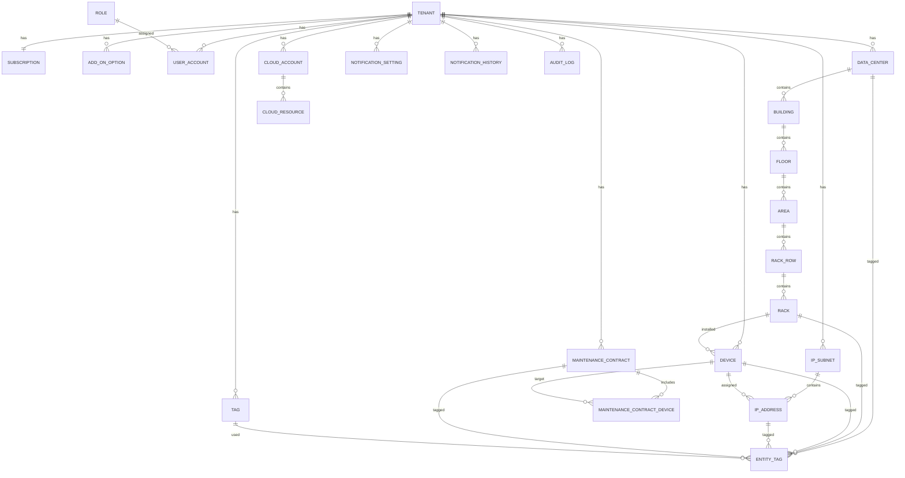

# ER図

## 1. 目的

本書は、Data Center Asset & Infrastructure Manager の基本設計におけるER図および主要テーブルを定義する。

DBはMariaDBを想定する。

## 2. ER図

## 3. 主要テーブル一覧

| テーブル名 | 概要 |
|---|---|
| tenant | テナント |
| subscription | 契約プラン・利用上限 |
| add_on_option | 追加オプション |
| user_account | ユーザー |
| role | ロール |
| permission | 権限 |
| role_permission | ロール権限対応 |
| data_center | データセンター |
| building | 建物・棟 |
| floor | フロア |
| area | エリア |
| rack_row | ラック列 |
| rack | ラック |
| rack_template | ラックテンプレート |
| device | 機器 |
| device_alias | 機器別名 |
| ip_subnet | IPサブネット |
| ip_address | IPアドレス |
| maintenance_contract | 保守契約 |
| maintenance_contract_device | 保守契約対象機器 |
| cloud_account | 将来拡張：クラウドアカウント |
| cloud_resource | 将来拡張：クラウドリソース |
| tag | タグ |
| entity_tag | エンティティタグ関連 |
| notification_setting | 通知設定 |
| notification_history | 通知履歴 |
| audit_log | 監査ログ |

## 4. テーブル定義案

### 4.1 tenant

| カラム | 型 | 制約 | 説明 |
|---|---|---|---|
| tenant_id | CHAR(36) | PK | テナントID |
| name | VARCHAR(255) | NOT NULL | テナント名 |
| status | VARCHAR(30) | NOT NULL | ステータス |
| created_at | DATETIME | NOT NULL | 作成日時 |
| updated_at | DATETIME | NOT NULL | 更新日時 |

### 4.2 subscription

| カラム | 型 | 制約 | 説明 |
|---|---|---|---|
| subscription_id | CHAR(36) | PK | 契約ID |
| tenant_id | CHAR(36) | FK, NOT NULL | テナントID |
| plan_type | VARCHAR(30) | NOT NULL | Free/Starter/Business/Enterprise |
| max_data_centers | INT | NOT NULL | DC上限 |
| max_racks | INT | NOT NULL | ラック上限 |
| max_devices | INT | NOT NULL | 機器上限 |
| max_ip_subnets | INT | NOT NULL | IPサブネット上限 |
| trial_days | INT | NULL | Freeトライアル日数 |
| max_users | INT | NOT NULL | ユーザー上限 |
| started_at | DATE | NOT NULL | 開始日 |
| ended_at | DATE | NULL | 終了日 |

### 4.3 add_on_option

| カラム | 型 | 制約 | 説明 |
|---|---|---|---|
| add_on_option_id | CHAR(36) | PK | オプションID |
| tenant_id | CHAR(36) | FK, NOT NULL | テナントID |
| option_type | VARCHAR(30) | NOT NULL | IP_SUBNET_PACK / DEVICE_PACK |
| quantity | INT | NOT NULL | 追加単位数 |
| enabled | BOOLEAN | NOT NULL | 有効状態 |

### 4.4 data_center

| カラム | 型 | 制約 | 説明 |
|---|---|---|---|
| data_center_id | CHAR(36) | PK | データセンターID |
| tenant_id | CHAR(36) | FK, NOT NULL | テナントID |
| official_name | VARCHAR(255) | NOT NULL | 正式名称 |
| display_name | VARCHAR(255) | NULL | 表示名・呼称名 |
| region | VARCHAR(100) | NULL | 地域 |
| prefecture | VARCHAR(100) | NULL | 都道府県 |
| address | VARCHAR(500) | NULL | 住所 |
| contact_email | VARCHAR(255) | NULL | 連絡先メール |
| contact_phone | VARCHAR(50) | NULL | 連絡先電話番号 |
| status | VARCHAR(30) | NOT NULL | ステータス |

### 4.5 rack

| カラム | 型 | 制約 | 説明 |
|---|---|---|---|
| rack_id | CHAR(36) | PK | ラックID |
| tenant_id | CHAR(36) | FK, NOT NULL | テナントID |
| rack_row_id | CHAR(36) | FK, NOT NULL | ラック列ID |
| official_name | VARCHAR(255) | NOT NULL | 正式名称 |
| display_name | VARCHAR(255) | NULL | 表示名・呼称名 |
| height_u | INT | NOT NULL | U数 |
| position_no | VARCHAR(50) | NULL | ラック列内位置 |
| status | VARCHAR(30) | NOT NULL | ステータス |

### 4.6 device

| カラム | 型 | 制約 | 説明 |
|---|---|---|---|
| device_id | CHAR(36) | PK | 機器ID |
| tenant_id | CHAR(36) | FK, NOT NULL | テナントID |
| rack_id | CHAR(36) | FK, NULL | 設置ラックID |
| official_name | VARCHAR(255) | NOT NULL | 正式名称 |
| display_name | VARCHAR(255) | NULL | 表示名・呼称名 |
| device_type | VARCHAR(50) | NOT NULL | Server/Switch/Router/FW/LB等 |
| vendor | VARCHAR(255) | NULL | ベンダー |
| model_name | VARCHAR(255) | NULL | 型番 |
| serial_number | VARCHAR(255) | NULL | シリアル番号 |
| rack_start_u | INT | NULL | 搭載開始U |
| rack_size_u | INT | NULL | 搭載U数 |
| status | VARCHAR(30) | NOT NULL | ステータス |

### 4.7 ip_subnet / ip_address

| カラム | 型 | 制約 | 説明 |
|---|---|---|---|
| ip_subnet_id | CHAR(36) | PK | IPサブネットID |
| tenant_id | CHAR(36) | FK, NOT NULL | テナントID |
| cidr | VARCHAR(50) | NOT NULL | CIDR表記 |
| name | VARCHAR(255) | NULL | サブネット名 |
| status | VARCHAR(30) | NOT NULL | Active/Reserved/Deprecated |
| ip_address_id | CHAR(36) | PK | 個別IP利用状況ID |
| address | VARCHAR(45) | NOT NULL | IPv4/IPv6アドレス |
| assigned_device_id | CHAR(36) | FK, NULL | 割当機器ID |
| purpose | VARCHAR(255) | NULL | 用途 |

### 4.8 maintenance_contract

| カラム | 型 | 制約 | 説明 |
|---|---|---|---|
| maintenance_contract_id | CHAR(36) | PK | 保守契約ID |
| tenant_id | CHAR(36) | FK, NOT NULL | テナントID |
| contract_name | VARCHAR(255) | NOT NULL | 契約名 |
| vendor_name | VARCHAR(255) | NULL | ベンダー |
| contract_no | VARCHAR(255) | NULL | 契約番号 |
| start_date | DATE | NULL | 開始日 |
| end_date | DATE | NOT NULL | 終了日 |
| notify_before_days | INT | NOT NULL | 通知日前。標準60 |
| status | VARCHAR(30) | NOT NULL | ステータス |

### 4.9 maintenance_contract_device

| カラム | 型 | 制約 | 説明 |
|---|---|---|---|
| maintenance_contract_device_id | CHAR(36) | PK | 関連ID |
| tenant_id | CHAR(36) | FK, NOT NULL | テナントID |
| maintenance_contract_id | CHAR(36) | FK, NOT NULL | 保守契約ID |
| device_id | CHAR(36) | FK, NOT NULL | 機器ID |

### 4.10 cloud_account / cloud_resource（将来拡張）

| テーブル | 主なカラム | 説明 |
|---|---|---|
| cloud_account | cloud_account_id, tenant_id, provider, account_name, account_identifier | AWS等のアカウント |
| cloud_resource | cloud_resource_id, tenant_id, cloud_account_id, resource_type, resource_name, region, external_resource_id, status | EC2/EKS/コンテナ等 |

## 5. インデックス方針

| 対象 | インデックス方針 |
|---|---|
| 全主要テーブル | tenant_idにインデックスを付与 |
| 一覧検索対象 | 名称、種別、ステータス、タグ関連にインデックスを検討 |
| IPサブネット | tenant_id + cidr をユニーク制約候補とする
| IPアドレス | tenant_id + ip_subnet_id + address をユニーク制約候補とする |
| 機器 | tenant_id + official_name、serial_numberを検索対象とする |
| 保守契約 | tenant_id + end_date にインデックスを付与 |
| 監査ログ | tenant_id + occurred_at にインデックスを付与 |

## 6. 削除方針

| 対象 | 方針 |
|---|---|
| 主要マスタ | 論理削除を原則とする |
| 関連テーブル | 物理削除可。ただし監査ログは保持する |
| 監査ログ | 原則削除しない。保持期間は別途運用設計で定義 |
