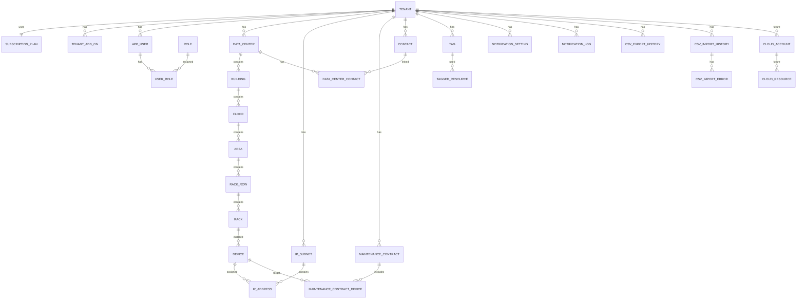

# ER図

## 1. 目的

本書は、Data Center Asset & Infrastructure Manager の基本設計におけるER図および主要テーブルを定義する。

詳細なカラム定義は `docs/04_detailed_design/02_table_definition.md` を正とし、本書では基本設計レベルの主要テーブル、関連、インデックス方針を整理する。初期リリースのID型は詳細設計に合わせて `bigint` を採用する。

## 2. ER図

## 3. 主要テーブル一覧

| テーブル名 | 概要 | 初期対象 |
|---|---|:---:|
| tenant | テナント | ○ |
| subscription_plan | 契約プラン・利用上限 | ○ |
| tenant_add_on | テナント別追加利用枠 | ○ |
| app_user | ユーザー | ○ |
| role | ロール | ○ |
| user_role | ユーザー・ロール関連 | ○ |
| region | 地域 | ○ |
| data_center | データセンター | ○ |
| building | 建物・棟 | ○ |
| floor | フロア | ○ |
| area | 区画 | ○ |
| rack_row | ラック列 | ○ |
| rack | ラック | ○ |
| device | 機器 | ○ |
| ip_subnet | IPサブネット | ○ |
| ip_address | IPアドレス利用状況 | ○ |
| maintenance_contract | 保守契約 | ○ |
| maintenance_contract_device | 保守契約対象機器 | ○ |
| contact | 連絡先 | ○ |
| data_center_contact | データセンター・連絡先関連 | ○ |
| tag | タグ | ○ |
| tagged_resource | タグ関連 | ○ |
| notification_setting | 通知設定 | ○ |
| notification_log | 通知履歴・メール送信履歴 | ○ |
| csv_export_history | CSV出力履歴 | ○ |
| csv_import_history | CSV取込履歴 | 初期追加 |
| csv_import_error | CSV取込エラー | 初期追加 |
| cloud_account | 将来拡張：クラウドアカウント | 将来 |
| cloud_resource | 将来拡張：クラウドリソース | 将来 |
| audit_log | 将来拡張：監査ログ | 将来 |

## 4. テーブル定義案

### 4.0 共通カラム方針

主要テーブルには最低限の監査情報として以下の共通カラムを持たせる。

| カラム | 型 | 制約 | 説明 |
|---|---|---|---|
| tenant_id | bigint | 原則NOT NULL | テナント分離用ID |
| created_by | bigint | NOT NULL | 作成者ユーザーID |
| created_at | datetime(6) | NOT NULL | 作成日時 |
| updated_by | bigint | NOT NULL | 更新者ユーザーID |
| updated_at | datetime(6) | NOT NULL | 更新日時 |
| deleted | boolean | NOT NULL | 論理削除フラグ |

完全な操作履歴を記録する `audit_log` は将来拡張として扱う。

### 4.1 tenant

| カラム | 型 | 制約 | 説明 |
|---|---|---|---|
| tenant_id | bigint | PK | テナントID |
| tenant_name | varchar(100) | NOT NULL | テナント名 |
| plan_code | varchar(30) | FK, NOT NULL | 契約プランコード |
| trial_start_date | date | NULL | Freeトライアル開始日。Free以外はNULL可 |
| trial_end_date | date | NULL | Freeトライアル終了日。Free以外はNULL可 |
| status | varchar(30) | NOT NULL | ACTIVE / SUSPENDED / TRIAL_EXPIRED / CANCELLED |

### 4.2 subscription_plan

| カラム | 型 | 制約 | 説明 |
|---|---|---|---|
| plan_id | bigint | PK | プランID |
| plan_code | varchar(30) | UNIQUE, NOT NULL | FREE / STARTER / BUSINESS / ENTERPRISE |
| plan_name | varchar(100) | NOT NULL | プラン名 |
| max_data_centers | int | NOT NULL | DC上限 |
| max_racks | int | NOT NULL | ラック上限 |
| max_devices | int | NOT NULL | 機器上限 |
| max_ip_subnets | int | NOT NULL | IPサブネット上限 |
| trial_days | int | NULL | Freeトライアル日数。標準14 |
| max_users | int | NOT NULL | ユーザー上限 |

### 4.3 tenant_add_on

| カラム | 型 | 制約 | 説明 |
|---|---|---|---|
| tenant_add_on_id | bigint | PK | 追加枠ID |
| tenant_id | bigint | FK, NOT NULL | テナントID |
| add_on_type | varchar(30) | NOT NULL | IP_SUBNET / DEVICE |
| quantity_unit | int | NOT NULL | 追加単位数 |
| effective_from | date | NOT NULL | 有効開始日 |
| effective_to | date | NULL | 有効終了日 |

### 4.4 data_center / location hierarchy

| テーブル | 主なカラム | 説明 |
|---|---|---|
| data_center | data_center_id, tenant_id, region_id, formal_name, display_name, address, status | データセンター |
| building | building_id, tenant_id, data_center_id, formal_name, display_name | 棟 |
| floor | floor_id, tenant_id, building_id, floor_name, floor_number | フロア |
| area | area_id, tenant_id, floor_id, area_name, direction | 区画 |
| rack_row | rack_row_id, tenant_id, area_id, row_name | ラック列 |
| rack | rack_id, tenant_id, rack_row_id, formal_name, display_name, rack_number, height_unit, status | ラック |

### 4.5 device

| カラム | 型 | 制約 | 説明 |
|---|---|---|---|
| device_id | bigint | PK | 機器ID |
| tenant_id | bigint | FK, NOT NULL | テナントID |
| rack_id | bigint | FK, NULL | 設置ラックID |
| device_type | varchar(30) | NOT NULL | SERVER / SWITCH等 |
| formal_name | varchar(150) | NOT NULL | 正式名称 |
| display_name | varchar(150) | NULL | 表示名 |
| hostname | varchar(150) | NULL | ホスト名 |
| serial_number | varchar(100) | NULL | シリアル番号 |
| rack_unit_start | int | NULL | 搭載開始U |
| rack_unit_size | int | NULL | 使用U数 |
| lifecycle_status | varchar(30) | NOT NULL | ACTIVE / SPARE / RETIRED等 |

### 4.6 ip_subnet / ip_address

| テーブル | 主なカラム | 説明 |
|---|---|---|
| ip_subnet | ip_subnet_id, tenant_id, subnet_name, cidr, ip_version, status, description | IPサブネット。プラン上限対象 |
| ip_address | ip_address_id, tenant_id, ip_subnet_id, ip_address, ip_version, device_id, usage_status, description | 個別IP利用状況 |

### 4.7 maintenance_contract

| テーブル | 主なカラム | 説明 |
|---|---|---|
| maintenance_contract | maintenance_contract_id, tenant_id, contract_name, vendor_name, contract_number, start_date, end_date, notification_enabled, notification_days_before | 保守契約 |
| maintenance_contract_device | maintenance_contract_device_id, tenant_id, maintenance_contract_id, device_id | 保守契約・機器関連 |

### 4.8 contact / tag

| テーブル | 主なカラム | 説明 |
|---|---|---|
| contact | contact_id, tenant_id, contact_type, name, email, phone_number | 連絡先 |
| data_center_contact | data_center_id, contact_id | データセンターと連絡先の関連 |
| tag | tag_id, tenant_id, tag_name, color_code | タグ |
| tagged_resource | tagged_resource_id, tenant_id, tag_id, resource_type, resource_id | タグと対象リソースの関連 |

### 4.9 notification / CSV tables

| テーブル | 主なカラム | 説明 |
|---|---|---|
| notification_setting | notification_setting_id, tenant_id, notification_type, enabled, email_enabled, days_before | 通知設定 |
| notification_log | notification_log_id, tenant_id, notification_type, target_type, target_id, recipient, subject, status, sent_at, error_message | 通知履歴・メール送信履歴 |
| csv_export_history | csv_export_history_id, tenant_id, target_type, condition_summary, file_name, record_count, requested_by, created_at | CSV出力履歴 |
| csv_import_history | csv_import_history_id, tenant_id, target_type, file_name, status, total_count, success_count, failure_count, requested_by, created_at | CSV取込履歴 |
| csv_import_error | csv_import_error_id, csv_import_history_id, row_number, column_name, error_message | CSV取込エラー |

### 4.10 cloud_account / cloud_resource（将来拡張）

| テーブル | 主なカラム | 説明 |
|---|---|---|
| cloud_account | cloud_account_id, tenant_id, provider, account_name, account_identifier | AWS等のアカウント |
| cloud_resource | cloud_resource_id, tenant_id, cloud_account_id, resource_type, resource_name, region_name, resource_identifier, status | EC2/EKS/コンテナ等 |

## 5. インデックス方針

| 対象 | インデックス方針 |
|---|---|
| 全主要テーブル | tenant_id, deleted にインデックスを付与 |
| 一覧検索対象 | 名称、種別、ステータス、タグ関連にインデックスを検討 |
| ロケーション階層 | tenant_id + parent_id + name にインデックスを検討 |
| 通知履歴 | tenant_id + notification_type + sent_at にインデックスを検討 |
| CSV取込履歴 | tenant_id + target_type + created_at にインデックスを検討 |
| IPサブネット | tenant_id + cidr をユニーク制約候補とする |
| IPアドレス | tenant_id + ip_subnet_id + ip_address をユニーク制約候補とする |
| 機器 | tenant_id + formal_name、serial_numberを検索対象とする |
| 保守契約 | tenant_id + end_date にインデックスを付与 |
| 監査ログ | 将来拡張。tenant_id + occurred_at にインデックスを付与 |

## 6. 削除方針

| 対象 | 方針 |
|---|---|
| 主要マスタ | 論理削除を原則とし、deletedを共通項目とする |
| 関連テーブル | 業務上の履歴性が低いものは物理削除可。ただし整合性に注意する |
| 通知ログ・CSV履歴 | 問い合わせ対応・監査補助のため原則保持する |
| 監査ログ | 将来拡張。原則削除しない。保持期間は運用設計で定義 |
