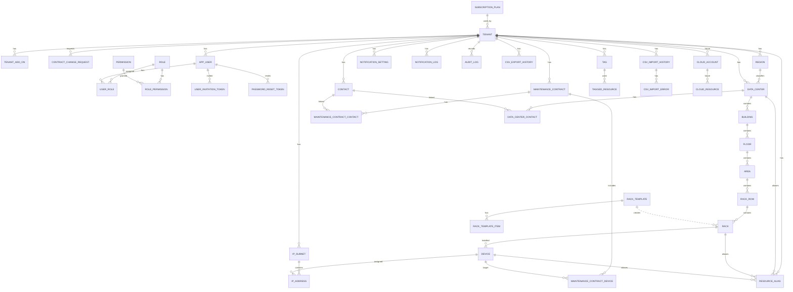

# ER図

## 1. 目的

本書は、Data Center Asset & Infrastructure Manager の基本設計におけるER図および主要テーブルを定義する。

詳細なカラム定義は `docs/04_detailed_design/02_table_definition.md` を正とし、本書では基本設計レベルの主要テーブル、関連、インデックス方針を整理する。初期リリースのID型は詳細設計に合わせて `bigint` を採用する。

## 2. ER図

## 3. 主要テーブル一覧

| テーブル名 | 概要 | 初期対象 |
|---|---|:---:|
| tenant | テナント | ○ |
| subscription_plan | 契約プラン・利用上限 | ○ |
| tenant_add_on | テナント別追加利用枠 | ○ |
| contract_change_request | プラン/オプション変更申請 | ○ |
| app_user | ユーザー。ログイン認証情報としてパスワードハッシュを保持 | ○ |
| password_reset_token | パスワード再設定トークン | ○ |
| user_invitation_token | ユーザー招待トークン | ○ |
| role | 要件定義7ロール | ○ |
| permission | 権限マスタ | ○ |
| role_permission | ロール・権限関連 | ○ |
| user_role | ユーザー・ロール関連 | ○ |
| region | 地域 | ○ |
| data_center | データセンター | ○ |
| building | 建物・棟 | ○ |
| floor | フロア | ○ |
| area | 区画 | ○ |
| rack_row | ラック列 | ○ |
| rack | ラック | ○ |
| rack_template | ラックテンプレート | ○ |
| rack_template_item | ラックテンプレート明細 | ○ |
| device | 機器 | ○ |
| ip_subnet | IPサブネット | ○ |
| ip_address | IPアドレス利用状況 | ○ |
| maintenance_contract | 保守契約 | ○ |
| maintenance_contract_device | 保守契約対象機器 | ○ |
| maintenance_contract_contact | 保守契約・連絡先関連 | ○ |
| contact | 連絡先 | ○ |
| data_center_contact | データセンター・連絡先関連 | ○ |
| tag | タグ | ○ |
| tagged_resource | タグ関連 | ○ |
| resource_alias | 呼称名・別名 | ○ |
| notification_setting | 通知設定 | ○ |
| notification_log | 通知履歴・メール/画面内通知履歴 | ○ |
| csv_export_history | CSV出力履歴 | ○ |
| csv_import_history | CSV取込履歴 | 初期追加 |
| csv_import_error | CSV取込エラー | 初期追加 |
| cloud_account | 将来拡張：クラウドアカウント | 将来 |
| cloud_resource | 将来拡張：クラウドリソース | 将来 |
| audit_log | 初期必須：操作履歴。変更差分の完全履歴は将来拡張 | ○ |

## 4. テーブル定義案

### 4.0 共通カラム方針

主要テーブルには最低限の監査情報として以下の共通カラムを持たせる。

| カラム | 型 | 制約 | 説明 |
|---|---|---|---|
| tenant_id | bigint | 原則NOT NULL | テナント分離用ID。`audit_log` などシステム管理操作・未認証操作を扱う履歴系テーブルではNULL可の例外を認める |
| created_by | bigint | NOT NULL | 作成者ユーザーID |
| created_at | datetime(6) | NOT NULL | 作成日時 |
| updated_by | bigint | NOT NULL | 更新者ユーザーID |
| updated_at | datetime(6) | NOT NULL | 更新日時 |
| deleted | boolean | NOT NULL | 論理削除フラグ |

初期リリースでは `audit_log` に操作履歴を記録する。`audit_log.tenant_id` はシステム管理操作、`actor_user_id` は未認証ログイン失敗でNULL可とする。変更差分を含む完全な変更履歴は将来拡張として扱う。

### 4.1 tenant

| カラム | 型 | 制約 | 説明 |
|---|---|---|---|
| tenant_id | bigint | PK | テナントID |
| tenant_name | varchar(100) | NOT NULL | テナント名 |
| plan_code | varchar(30) | FK, NOT NULL | 契約プランコード |
| trial_start_date | date | NULL | Freeトライアル開始日。Free以外はNULL可 |
| trial_end_date | date | NULL | Freeトライアル終了日。Free以外はNULL可 |
| status | varchar(30) | NOT NULL | ACTIVE / SUSPENDED / TRIAL_EXPIRED / CANCELLED |

### 4.1A app_user / role / user_role

| テーブル | 主なカラム | 説明 |
|---|---|---|
| app_user | user_id, tenant_id, email, display_name, password_hash, password_updated_at, status | 利用者。パスワードは平文保存せずハッシュのみ保持 |
| password_reset_token | password_reset_token_id, tenant_id, user_id, token_hash, expires_at, used_at | パスワード再設定用トークン。平文トークンは保存しない |
| user_invitation_token | invitation_token_id, tenant_id, email, role_id, token_hash, expires_at, accepted_at, cancelled_at, invited_by | 招待承諾用トークン。期限付き・一度限り。再招待時は旧トークンを取消する |
| permission | permission_id, permission_code, permission_name | 権限マスタ。標準権限を初期投入する |
| role_permission | role_permission_id, role_id, permission_id | ロール別標準権限。初期リリースでは固定マスタとして扱う |
| role | role_id, role_code, role_name | ロール定義 |
| user_role | user_role_id, tenant_id, user_id, role_id | ユーザー・ロール関連 |

### 4.2 subscription_plan

| カラム | 型 | 制約 | 説明 |
|---|---|---|---|
| plan_id | bigint | PK | プランID |
| plan_code | varchar(30) | UNIQUE, NOT NULL | FREE / STARTER / BUSINESS / ENTERPRISE |
| plan_name | varchar(100) | NOT NULL | プラン名 |
| max_data_centers | int | NOT NULL | DC上限 |
| max_racks | int | NOT NULL | ラック上限 |
| max_devices | int | NOT NULL | 機器上限 |
| max_ip_addresses | int | NOT NULL | 管理対象IP数上限 |
| max_tags | int | NOT NULL | タグマスタ件数上限 |
| trial_days | int | NULL | Freeトライアル日数。標準14 |
| max_users | int | NOT NULL | ユーザー上限 |

### 4.3 tenant_add_on

| カラム | 型 | 制約 | 説明 |
|---|---|---|---|
| tenant_add_on_id | bigint | PK | 追加枠ID |
| tenant_id | bigint | FK, NOT NULL | テナントID |
| add_on_type | varchar(30) | NOT NULL | IP_ADDRESS / DEVICE |
| quantity_unit | int | NOT NULL | 追加単位数 |
| effective_from | date | NOT NULL | 有効開始日 |
| effective_to | date | NULL | 有効終了日 |

### 4.4 data_center / location hierarchy

| テーブル | 主なカラム | 説明 |
|---|---|---|
| region | region_id, tenant_id, region_code, region_name, prefecture, display_order, status | 地域・都道府県分類 |
| data_center | data_center_id, tenant_id, region_id, formal_name, display_name, address, status | データセンター。複数の呼称名・別名は `resource_alias` で保持 |
| building | building_id, tenant_id, data_center_id, formal_name, display_name | 棟 |
| floor | floor_id, tenant_id, building_id, floor_name, floor_number | フロア |
| area | area_id, tenant_id, floor_id, area_name, direction | 区画 |
| rack_row | rack_row_id, tenant_id, area_id, row_name | ラック列 |
| rack | rack_id, tenant_id, rack_row_id, formal_name, display_name, rack_number, height_unit, status | ラック。複数の呼称名・別名は `resource_alias` で保持 |
| rack_template | rack_template_id, tenant_id, template_name, height_unit, category, active | ラック作成時に利用する標準構成テンプレート |
| rack_template_item | rack_template_item_id, tenant_id, rack_template_id, item_type, start_unit, unit_size, label | テンプレート内の標準搭載構成・予約U範囲 |

### 4.5 device

| カラム | 型 | 制約 | 説明 |
|---|---|---|---|
| device_id | bigint | PK | 機器ID |
| tenant_id | bigint | FK, NOT NULL | テナントID |
| rack_id | bigint | FK, NULL | 設置ラックID |
| device_type | varchar(30) | NOT NULL | SERVER / SWITCH等 |
| formal_name | varchar(150) | NOT NULL | 正式名称 |
| display_name | varchar(150) | NULL | 代表表示名。複数の呼称名・別名は `resource_alias` で保持 |
| hostname | varchar(150) | NULL | ホスト名 |
| serial_number | varchar(100) | NULL | シリアル番号 |
| rack_unit_start | int | NULL | 搭載開始U |
| rack_unit_size | int | NULL | 使用U数 |
| lifecycle_status | varchar(30) | NOT NULL | ACTIVE / SPARE / PLANNED_RETIREMENT / RETIRED |

### 4.6 ip_subnet / ip_address

| テーブル | 主なカラム | 説明 |
|---|---|---|
| ip_subnet | ip_subnet_id, tenant_id, subnet_name, cidr, ip_version, status, description | IPサブネット。サブネット数はプラン上限対象外 |
| ip_address | ip_address_id, tenant_id, ip_subnet_id, ip_address, ip_version, device_id, usage_status, registration_mode, description | 個別IP利用状況。IPv4は範囲生成/明示登録、IPv6は明示登録のみ |

### 4.7 maintenance_contract

| テーブル | 主なカラム | 説明 |
|---|---|---|
| maintenance_contract | maintenance_contract_id, tenant_id, contract_name, vendor_name, contract_number, contract_description, renewal_status, start_date, end_date, notification_enabled, notification_days_before, note | 保守契約。期限状態は原則としてend_dateから算出し永続化しない |
| maintenance_contract_device | maintenance_contract_device_id, tenant_id, maintenance_contract_id, device_id | 保守契約・機器関連 |
| maintenance_contract_contact | maintenance_contract_contact_id, tenant_id, maintenance_contract_id, contact_id, contact_role | 保守契約・連絡先関連 |

### 4.8 contact / tag / resource_alias

| テーブル | 主なカラム | 説明 |
|---|---|---|
| contact | contact_id, tenant_id, contact_type, organization_name, department_name, position_name, person_name, email, phone_number, address, preferred_contact_method, note, active | 連絡先 |
| data_center_contact | data_center_contact_id, tenant_id, data_center_id, contact_id, contact_role | データセンターと連絡先の関連 |
| tag | tag_id, tenant_id, tag_name, color_code | タグ。タグマスタ件数はプラン上限対象 |
| tagged_resource | tagged_resource_id, tenant_id, tag_id, resource_type, resource_id | タグと対象リソースの関連 |
| resource_alias | resource_alias_id, tenant_id, resource_type, resource_id, alias_name, alias_type | 対象リソースの呼称名・別名 |

### 4.9 notification / CSV tables

| テーブル | 主なカラム | 説明 |
|---|---|---|
| notification_setting | notification_setting_id, tenant_id, notification_type, timing_code, enabled, email_enabled, in_app_enabled, days_before, target_roles | 通知設定。通知種別とタイミングごとに行を分ける |
| notification_log | notification_log_id, tenant_id, notification_type, channel, target_type, target_id, timing_code, notification_level, reference_date, recipient, recipient_user_id, subject, body, summary, action_url, source_process, retry_required, status, sent_at, read_at, error_message, occurrence_count | 通知履歴・メール/画面内通知履歴。OPERATION_ERRORの集約と画面遷移にも利用。システム通知ではtenant_id NULLまたはシステムテナントを許容 |
| csv_export_history | csv_export_history_id, tenant_id, target_type, condition_summary, file_name, record_count, requested_by, created_at | CSV出力履歴 |
| csv_import_history | csv_import_history_id, tenant_id, target_type, file_name, status, total_count, success_count, failure_count, requested_by, created_at | CSV取込履歴 |
| csv_import_error | csv_import_error_id, csv_import_history_id, row_number, column_name, error_message | CSV取込エラー |
| audit_log | audit_log_id, tenant_id, actor_user_id, action_type, target_type, target_id, result, ip_address, occurred_at, summary | 操作履歴。登録/更新/削除/招待/権限変更/契約変更/通知設定変更等を保存。システム管理操作ではtenant_id、未認証ログイン失敗ではactor_user_idをNULL可とする |

### 4.10 cloud_account / cloud_resource（将来拡張）

| テーブル | 主なカラム | 説明 |
|---|---|---|
| cloud_account | cloud_account_id, tenant_id, provider, account_name, account_identifier | AWS等のアカウント |
| cloud_resource | cloud_resource_id, tenant_id, cloud_account_id, resource_type, resource_name, region_name, resource_identifier, status | EC2/EKS/コンテナ等 |

## 5. インデックス方針

| 対象 | インデックス方針 |
|---|---|
| 全主要テーブル | tenant_id, deleted にインデックスを付与 |
| 一覧検索対象 | 名称、種別、ステータス、タグ関連にインデックスを検討 |
| タグ関連 | tenant_id + tag_id + resource_type + resource_id にインデックスを検討 |
| ロケーション階層 | tenant_id + parent_id + name にインデックスを検討 |
| 通知履歴 | tenant_id + notification_type + sent_at にインデックスを検討 |
| CSV取込履歴 | tenant_id + target_type + created_at にインデックスを検討 |
| IPサブネット | tenant_id + ip_version + cidr をユニーク制約候補とする |
| IPアドレス | tenant_id + ip_subnet_id + ip_address をユニーク制約候補とする |
| 機器 | tenant_id + formal_name、serial_numberを検索対象とする |
| 呼称名・別名 | tenant_id + resource_type + resource_id、tenant_id + alias_name にインデックスを検討 |
| 保守契約 | tenant_id + end_date にインデックスを付与 |
| 保守契約番号 | tenant_id + contract_number にユニーク制約候補を設定し、削除済みを含めて重複禁止とする |
| 操作履歴 | tenant_id + occurred_at、actor_user_id + occurred_at、target_type + target_id にインデックスを付与 |

## 5.1 論理削除と一意性制約

通常の一覧・検索では `deleted = false` を条件にする。ただし、業務上の識別子は削除済みデータを含めて重複禁止とする。

| 区分 | 対象例 | 方針 |
|---|---|---|
| 削除済みを含めて重複禁止 | ユーザーメール、機器シリアル番号、保守契約番号、IPサブネットCIDR、有効IPアドレス | DBのユニーク制約またはService側チェックで担保する。論理削除後も同一識別子の再利用は不可 |
| 有効データ内で重複禁止 | データセンター正式名称、ラック名、タグ名、地域名、別名 | `deleted = false` の範囲で重複禁止とし、削除後の名称再利用は業務影響を確認して許容する |
| 履歴テーブル | 通知ログ、CSV履歴 | 原則として削除せず、識別子再利用判定の対象外 |
| 操作履歴 | audit_log | プラン別保持期間内は検索可能とし、期限超過後は削除またはアーカイブする |

DB制約だけで論理削除条件を表現しづらい項目は、Application Serviceで削除済みを含めて検索し、登録・更新時に業務例外とする。

## 6. 削除方針

| 対象 | 方針 |
|---|---|
| 主要マスタ | 論理削除を原則とし、deletedを共通項目とする |
| 関連テーブル | 業務上の履歴性が低いものは物理削除可。ただし整合性に注意する |
| 通知ログ・CSV履歴 | 問い合わせ対応・監査補助のため原則保持する |
| 操作履歴 | 初期必須。Free 7日、Starter 30日、Business 1年、Enterprise 個別契約のプラン別保持期間に従って保持・整理する |
