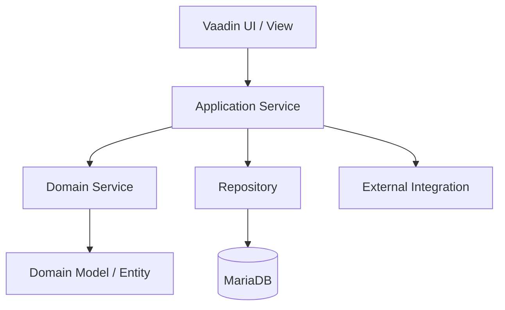
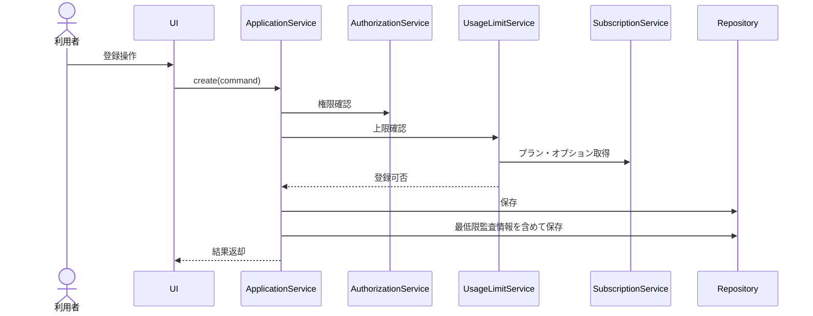

# API・サービス設計方針

## 1. 目的

本書は、Data Center Asset & Infrastructure Manager のAPIおよびサービス設計方針を定義する。

画面はVaadinを主とするが、内部サービス層を明確化し、将来的なREST API公開や外部連携にも耐えられる構成とする。

## 2. 基本方針

- Spring Bootを利用する。
- Vaadin画面からApplication Serviceを呼び出す。
- ドメインロジックはDomain ServiceまたはEntityに寄せる。
- Repositoryは永続化責務に限定する。
- APIは当初は内部利用中心とし、将来的にREST API化できる命名・DTO設計にする。
- テナント分離、権限チェック、プラン上限チェックをサービス層で必ず実施する。

## 3. レイヤ構成



## 4. パッケージ構成案

```text
com.example.dcim
  ├── config
  ├── security
  ├── common
  │   ├── exception
  │   ├── validation
  │   └── audit
  ├── tenant
  │   ├── domain
  │   ├── application
  │   ├── infrastructure
  │   └── ui
  ├── location
  ├── rack
  ├── device
  ├── ipsubnet
  ├── maintenance
  ├── cloud
  ├── notification
  └── user
```

## 5. サービス一覧

| サービスID | サービス名 | 主な責務 |
|---|---|---|
| SVC-001 | AuthService | ログイン、認証情報取得、ログイン成功/失敗の操作履歴記録依頼、パスワード再設定依頼、再設定トークン検証、パスワード更新、招待承諾トークン検証、初回パスワード設定 |
| SVC-002 | TenantService | システム管理者向けテナント登録・編集・解約、テナント情報取得、テナント状態確認 |
| SVC-003 | SubscriptionService | プラン情報取得、利用上限算出 |
| SVC-004 | UsageLimitService | DC、ラック、機器、管理対象IP、タグ、ユーザー、Freeトライアル期間、期限超過時の更新可否チェック |
| SVC-005 | DataCenterService | データセンター登録、更新、検索、詳細取得 |
| SVC-006 | LocationService | 建物、フロア、エリア、ラック列管理 |
| SVC-006A | RegionService | 地域・都道府県分類の登録、更新、検索 |
| SVC-006B | ContactService | 連絡先登録、更新、検索、関連付け |
| SVC-006C | ResourceAliasService | 呼称名・別名の登録、更新、検索 |
| SVC-007 | RackService | ラック登録、更新、検索、詳細取得 |
| SVC-008 | RackTemplateService | ラックテンプレート登録、編集、複製、無効化、テンプレートからラック作成 |
| SVC-009 | RackPlacementService | ラック搭載位置チェック、空きU算出 |
| SVC-010 | DeviceService | 機器登録、更新、検索、詳細取得、機器別名・タグ操作 |
| SVC-011 | IpSubnetService | IPv4/IPv6別のIPサブネット登録、IPv4範囲生成、IPv6明示登録、配下IP割当、解放、検索 |
| SVC-012 | MaintenanceContractService | 保守契約登録、対象機器ひもづけ、タグ付与/解除、検索 |
| SVC-013 | MaintenanceAlertService | 保守期限通知対象抽出、保守未設定機器抽出 |
| SVC-014 | CloudAccountService | 将来拡張。クラウドアカウント管理 |
| SVC-015 | CloudResourceService | 将来拡張。クラウドリソース管理、同期結果保存 |
| SVC-016 | TagService | タグ登録、更新、付与、解除 |
| SVC-017 | NotificationService | 通知設定、通知履歴管理、メール通知実行、画面内通知作成、未読/既読管理、送信失敗管理 |
| SVC-021 | CsvExportService | 初期必須。検索結果、主要一覧、保守未加入機器一覧、保守期限接近一覧のCSV出力 |
| SVC-022 | CsvImportService | 初期追加対象。初期リリースでは画面/APIを無効化し、初期追加時にCSV取込、検証、エラー結果管理を有効化 |
| SVC-018 | UserAccountService | ユーザー招待、更新、無効化、ロール変更 |
| SVC-019 | AuthorizationService | 権限チェック、ロール判定 |
| SVC-020 | AuditLogService | 初期必須。ログイン成功/失敗を含む操作履歴の記録、検索、閲覧。変更差分の完全履歴は将来拡張 |
| SVC-023 | SearchService | 横断検索、正式名称・表示名・別名・タグ検索、権限制御済み結果返却 |

## 6. API設計方針

### 6.1 URL設計方針

将来的にREST APIを公開する場合は、以下のようなURL体系とする。

| リソース | API例 |
|---|---|
| データセンター | `/api/v1/data-centers` |
| リージョン | `/api/v1/regions` |
| 連絡先 | `/api/v1/contacts` |
| 呼称名・別名 | `/api/v1/resource-aliases` または `/api/v1/{resource}/{id}/aliases` |
| ラック | `/api/v1/racks` |
| 機器 | `/api/v1/devices` |
| IPサブネット | `/api/v1/ip-subnets` |
| IP利用状況 | `/api/v1/ip-addresses` |
| 保守契約 | `/api/v1/maintenance-contracts` |
| 通知設定 | `/api/v1/notification-settings` |
| 通知 | `/api/v1/notifications`、`/api/v1/notifications/{id}/read` |
| CSV出力 | `/api/v1/csv/exports` |
| CSV取込 | `/api/v1/csv/imports`（初期追加フェーズで有効化） |
| 将来拡張：クラウドアカウント | `/api/v1/cloud-accounts` |
| 将来拡張：クラウドリソース | `/api/v1/cloud-resources` |
| タグ | `/api/v1/tags` |
| ユーザー | `/api/v1/users` |
| 利用状況 | `/api/v1/usage` |
| テナント管理 | `/api/v1/system/tenants` |
| 横断検索 | `/api/v1/search` |
| 操作履歴 | `/api/v1/audit-logs` |

### 6.2 HTTPメソッド方針

| メソッド | 用途 |
|---|---|
| GET | 一覧取得、詳細取得 |
| POST | 新規作成、検索条件が複雑な検索 |
| PUT | 全体更新 |
| PATCH | 一部更新、ステータス変更 |
| DELETE | 削除。内部的には論理削除を原則とする |

### 6.3 DTO方針

| DTO種別 | 用途 |
|---|---|
| SearchCondition | 検索条件 |
| SummaryDto | 一覧表示用 |
| DetailDto | 詳細表示用 |
| CreateCommand | 新規登録要求 |
| UpdateCommand | 更新要求 |
| ResultDto | 登録・更新結果 |

## 7. 代表API案

### 7.0 認証

| API | メソッド | 概要 |
|---|---|---|
| `/api/v1/auth/password-reset-requests` | POST | パスワード再設定メール送信依頼 |
| `/api/v1/auth/password-resets/{token}` | GET | 再設定トークン検証 |
| `/api/v1/auth/password-resets/{token}` | POST | 新パスワード設定 |
| `/api/v1/users/{id}/password-reset-requests` | POST | 管理者による再設定メール再送 |
| `/api/v1/auth/invitations/{token}` | GET | 招待トークン検証 |
| `/api/v1/auth/invitations/{token}/accept` | POST | 招待承諾・初回パスワード設定 |
| `/api/v1/users/invitations` | POST | ユーザー招待メール送信 |
| `/api/v1/users/invitations/{id}/cancel` | PATCH | 招待取消 |
| `/api/v1/users/invitations/{id}/resend` | POST | 再招待 |

### 7.1 データセンター

| API | メソッド | 概要 |
|---|---|---|
| `/api/v1/data-centers` | GET | データセンター一覧取得 |
| `/api/v1/data-centers/{id}` | GET | データセンター詳細取得 |
| `/api/v1/data-centers` | POST | データセンター登録 |
| `/api/v1/data-centers/{id}` | PUT | データセンター更新 |
| `/api/v1/data-centers/{id}` | DELETE | データセンター削除 |

### 7.2 機器

| API | メソッド | 概要 |
|---|---|---|
| `/api/v1/devices` | GET | 機器一覧取得 |
| `/api/v1/devices/{id}` | GET | 機器詳細取得 |
| `/api/v1/devices` | POST | 機器登録 |
| `/api/v1/devices/{id}` | PUT | 機器更新 |
| `/api/v1/devices/{id}/maintenance-contracts` | GET | 機器に紐づく保守契約取得 |
| `/api/v1/devices/without-maintenance` | GET | 保守未設定機器一覧取得 |
| `/api/v1/devices/{id}/aliases` | GET/POST | 機器別名一覧取得・追加 |
| `/api/v1/devices/{id}/aliases/{aliasId}` | PUT/DELETE | 機器別名更新・削除 |
| `/api/v1/devices/{id}/tags` | GET/POST | 機器タグ一覧取得・付与 |
| `/api/v1/devices/{id}/tags/{tagId}` | DELETE | 機器タグ解除 |

### 7.3 保守契約

| API | メソッド | 概要 |
|---|---|---|
| `/api/v1/maintenance-contracts` | GET | 保守契約一覧取得。期限状態、更新状態、契約番号、ベンダー、対象機器で検索可能 |
| `/api/v1/maintenance-contracts/{id}` | GET | 保守契約詳細取得。契約内容、備考、期限状態、更新状態を含む |
| `/api/v1/maintenance-contracts` | POST | 保守契約登録。契約内容、備考、更新状態を指定可能 |
| `/api/v1/maintenance-contracts/{id}` | PUT | 保守契約更新。契約内容、備考、更新状態を更新可能 |
| `/api/v1/maintenance-contracts/{id}/devices` | POST | 対象機器ひもづけ |
| `/api/v1/maintenance-contracts/{id}/tags` | GET/POST | 保守契約タグ一覧取得・付与 |
| `/api/v1/maintenance-contracts/{id}/tags/{tagId}` | DELETE | 保守契約タグ解除 |
| `/api/v1/maintenance-contracts/alerts` | GET | 保守期限アラート取得。期限切れ再通知状態も返却 |

### 7.4 利用状況

| API | メソッド | 概要 |
|---|---|---|
| `/api/v1/usage` | GET | 現在の利用状況取得 |
| `/api/v1/usage/limits` | GET | プラン上限取得 |
| `/api/v1/plan-change-requests` | POST | プラン変更申請 |
| `/api/v1/add-on-change-requests` | POST | オプション追加申請 |

### 7.4A ラックテンプレート

| API | メソッド | 概要 |
|---|---|---|
| `/api/v1/rack-templates` | GET/POST | ラックテンプレート一覧取得・登録 |
| `/api/v1/rack-templates/{id}` | GET/PUT/DELETE | ラックテンプレート詳細取得・更新・無効化 |
| `/api/v1/rack-templates/{id}/copy` | POST | ラックテンプレート複製 |
| `/api/v1/rack-templates/{id}/racks` | POST | テンプレートからラック作成 |

### 7.5 リージョン・連絡先・呼称名

| API | メソッド | 概要 |
|---|---|---|
| `/api/v1/regions` | GET/POST | リージョン一覧取得・登録 |
| `/api/v1/regions/{id}` | GET/PUT/DELETE | リージョン詳細取得・更新・削除 |
| `/api/v1/contacts` | GET/POST | 連絡先一覧取得・登録 |
| `/api/v1/contacts/{id}` | GET/PUT/DELETE | 連絡先詳細取得・更新・削除 |
| `/api/v1/resource-aliases` | GET/POST | 呼称名・別名検索・登録 |
| `/api/v1/{resource}/{id}/aliases` | GET/POST | 対象リソースの呼称名・別名取得・追加 |

### 7.6 通知・CSV

| API | メソッド | 概要 |
|---|---|---|
| `/api/v1/notification-settings` | GET/PUT | 通知設定取得・更新 |
| `/api/v1/notifications` | GET | 自分宛て通知一覧取得 |
| `/api/v1/notifications/{id}/read` | PATCH | 通知既読化 |
| `/api/v1/csv/exports` | POST | CSV出力要求。保守未加入機器一覧、保守期限接近一覧を含む |
| `/api/v1/csv/imports` | POST | CSV取込要求。初期追加フェーズで有効化し、初期リリースでは404または権限無効 |
| `/api/v1/csv/imports/{id}` | GET | CSV取込結果・エラー確認。初期追加フェーズで有効化 |
| `/api/v1/search` | GET/POST | 横断検索。対象種別、キーワード、タグ、別名、保守状態で検索 |
| `/api/v1/audit-logs` | GET | 操作履歴検索・閲覧 |
| `/api/v1/system/tenants` | GET/POST | システム管理者向けテナント一覧取得・登録 |
| `/api/v1/system/tenants/{id}` | GET/PUT | システム管理者向けテナント詳細取得・更新 |
| `/api/v1/system/tenants/{id}/cancel` | PATCH | システム管理者向けテナント解約 |

### 7.7 横断検索結果仕様

| 項目 | 内容 |
|---|---|
| 検索対象 | データセンター、ラック、機器、IPサブネット、IPアドレス、保守契約 |
| 検索キー | 正式名称、代表表示名、別名、タグ、契約番号、CIDR、IPアドレス |
| 結果項目 | 種別、表示名、補足情報、設置場所、タグ、最終更新日時、詳細画面URL |
| 権限制御 | 利用者の閲覧権限がある対象のみ返却する。契約管理者は利用状況確認目的の限定項目のみ返却 |

## 8. 共通処理方針

| 項目 | 方針 |
|---|---|
| 認証 | Spring Securityでログインセッション管理 |
| 認可 | メソッド実行前にロール・権限チェック |
| テナント分離 | すべての検索・更新でtenantId条件を必須化 |
| 入力チェック | Bean Validation + ドメイン制約チェック |
| 例外処理 | 業務例外、認可例外、システム例外を分類 |
| 最低限監査情報 | 登録・更新時に作成者、作成日時、更新者、更新日時を保存 |
| 操作履歴 | 初期必須。ログイン成功/失敗、登録、更新、削除、招待、権限変更、契約変更、通知設定変更を記録。変更差分の完全履歴は将来拡張 |
| トランザクション | Application Service単位で制御 |
| ページング | 一覧取得はページングを標準化 |
| CSV出力 | 初期必須。一覧検索条件に基づく出力を標準化 |
| CSV取込 | 初期追加対象。初期リリースでは画面/API/権限を無効化し、初期追加時に事前検証、行単位エラー、取込履歴を有効化 |
| メール通知 | 初期必須。通知履歴、送信失敗、再送要否を管理できる構造にする |
| 画面内通知 | 初期必須。通知ログ、未読/既読、ダッシュボード表示を管理できる構造にする |

### 8.1 操作エラー通知方針

操作エラー通知は `OPERATION_ERROR` として、一般的な `SYSTEM` 通知とは分離する。

| 発火契機 | 通知先 | チャネル | 備考 |
|---|---|---|---|
| CSV取込失敗・行エラー閾値超過 | 実行者、テナント管理者 | 画面内通知、必要に応じてメール | 取込履歴・エラー詳細へ遷移できること |
| メール送信失敗 | テナント管理者、システム管理者 | 画面内通知、運用メール | `notification_log` にFAILEDを記録 |
| 外部連携失敗 | テナント管理者、連携設定管理者 | 画面内通知、必要に応じてメール | 将来拡張の外部連携にも同じ通知種別を適用 |
| バッチ処理失敗 | テナント管理者、システム管理者 | 画面内通知、運用メール | バッチID・対象日・再実行要否を記録 |

重複抑止は `notification_type=OPERATION_ERROR`、`target_type`、`target_id`、`channel`、受信者単位で行う。同一原因の連続失敗は通知を集約し、通知ログには発生回数または最新エラー内容を保持する。

### 8.2 ログイン操作履歴

AuthServiceはログイン成功/失敗時にAuditLogServiceへ記録を依頼する。

| 項目 | 内容 |
|---|---|
| 記録契機 | ログイン成功、ログイン失敗 |
| 記録項目 | 入力メールアドレス、特定できる場合のuser_id、tenant_id、結果、失敗理由分類、IPアドレス、User-Agent、発生日時 |
| 閲覧権限 | システム管理者はシステム操作範囲、テナント管理者と監査担当者は自テナント範囲を閲覧可能 |
| 注意 | パスワードや認証トークンは記録しない |

## 9. プラン上限チェック方針



### 9.1 管理対象IP数上限

- IPサブネット数には上限を設けず、サブネット配下に生成・管理する個別IP数の上限をプラン別に持つ。
- Free 256、Starter 512、Business 1,024、Enterprise 2,048 IPを初期上限とする。
- IP上限追加オプションは256IP単位で、管理対象IP数上限に256件を追加する。
- IPv4はCIDRから必要範囲の個別IPを生成でき、生成予定数を含めて上限判定する。
- IPv6はサブネット情報と明示登録IPのみを初期対象とし、全範囲生成は行わない。明示登録したIPv6アドレスのみ管理対象IP数にカウントする。

## 10. 保守期限通知方針

- 保守期限通知は60日前、30日前、当日、期限切れを初期対象とする。
- 60日前は標準通知日とし、30日前・当日・期限切れは通知設定または既定タイミングとして抽出する。
- 通知対象はバッチまたはスケジューラで抽出する。
- 通知履歴を保存し、`notification_type`、`channel`、対象契約、宛先または`recipient_user_id`単位で重複通知を制御する。
- 期限切れ通知は初回期限切れ日に送信し、その後は7日ごとに再通知する。更新状態がRENEWED/TERMINATEDになった場合、通知無効化、契約削除時に停止する。

## 11. 外部連携方針

| 外部連携 | 方針 |
|---|---|
| メール通知 | 初期必須。SMTPまたはクラウドメールサービスを利用可能な設計にする |
| AWS連携 | 将来拡張。手動登録およびAPI同期を検討する |
| CSVインポート | 初期追加対象。データセンター、ラック、機器、IPサブネット/IP利用状況、保守契約の一括登録対象とする |
| CSVエクスポート | 初期必須。一覧画面の検索結果出力として実装する |

## 12. 命名方針

| 対象 | 方針 |
|---|---|
| Service | `XxxService` |
| Repository | `XxxRepository` |
| Entity | ドメイン名を単数形で命名 |
| DTO | `XxxSummaryDto`, `XxxDetailDto` |
| Command | `CreateXxxCommand`, `UpdateXxxCommand` |
| Enum | 業務用語 + `Type` / `Status` |

## 13. 実装上の注意

- Controller/APIを後から追加してもUI層を大きく変更しないよう、Application Serviceを中心に設計する。
- Vaadin Viewに業務ロジックを持たせない。
- RepositoryをUIから直接呼ばない。
- 権限チェックとテナントチェックを画面側だけに依存しない。
- 将来的なクラウドリソース自動同期に備え、外部IDを保持する。


## 14. Freeトライアル期限超過時のAPI制御

Freeトライアル期限超過テナントは `TRIAL_EXPIRED` として扱い、API・Service層で通常ロールより前に更新可否を判定する。

| 処理種別 | 可否 | 備考 |
|---|:---:|---|
| 参照系API | ○ | 既存データ確認のため許可 |
| CSVエクスポート | ○ | データ退避・棚卸のため許可 |
| 契約プラン変更 | ○ | 有料プラン移行のため許可 |
| 登録・更新・削除API | × | 期限超過中は不可 |
| CSVインポート | × | 新規登録扱いのため不可 |
| ユーザー招待 | × | テナント拡張扱いのため不可 |
