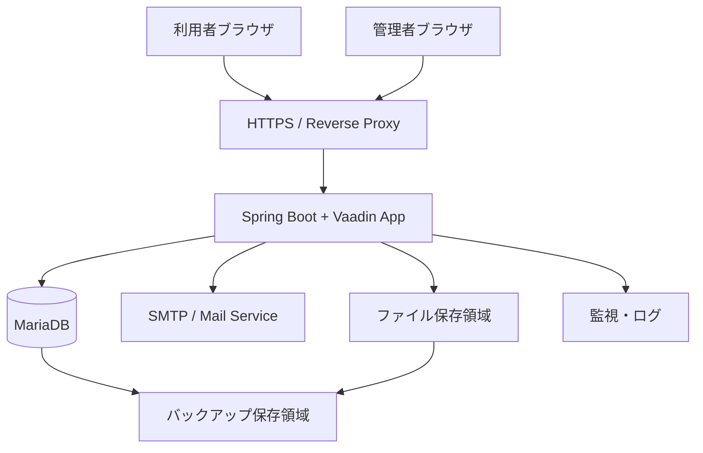

# システム構成設計

## 1. 目的

本書は、Data Center Asset & Infrastructure Manager（以下、本システム）の初期リリースにおけるシステム構成方針を定義する。

対象は、アプリケーション、データベース、メール送信、ファイル管理、バックアップ、監視、セキュリティ、環境分離である。

## 2. 前提

- 初期リリースは小規模〜中規模テナント向けのSaaSとして開始する。
- アプリケーションは Java / Spring Boot / Vaadin を前提とする。
- データベースは MariaDB を前提とする。
- マルチテナント方式は、初期リリースでは単一DB・単一スキーマ・`tenant_id` による論理分離とする。
- クラウド資産のAPI連携は将来拡張とし、初期リリースではメール通知とCSV連携を主な外部連携とする。

## 3. 初期構成案

## 4. 構成要素

| 区分 | 構成要素 | 初期方針 |
|---|---|---|
| Web / App | Spring Boot + Vaadin | 1アプリケーションとして提供する |
| DB | MariaDB | 単一DB・単一スキーマ・tenant_id分離 |
| Reverse Proxy | Nginx等 | HTTPS終端、静的配信、アクセス制御 |
| Mail | SMTP / 外部メールサービス | 保守期限通知、プラン上限警告、システム通知に利用 |
| Storage | ローカルまたはオブジェクトストレージ | CSV入出力一時ファイル、将来の添付ファイルに利用 |
| Backup | DB / ファイルバックアップ | 日次バックアップを基本とする |
| Monitoring | ログ・死活監視 | アプリログ、DB容量、バッチ失敗を監視 |

## 5. 環境構成

| 環境 | 用途 | 方針 |
|---|---|---|
| local | 開発者ローカル確認 | Docker ComposeまたはローカルMariaDBを利用 |
| dev | 開発・内部確認 | 機能確認用。テストデータを利用 |
| staging | リリース前確認 | 本番相当設定で受入確認 |
| production | 本番 | バックアップ、監視、HTTPSを必須とする |

## 6. セキュリティ方針

- 通信はHTTPSを必須とする。
- 認証情報、SMTPパスワード、DBパスワードは環境変数または秘密情報管理で扱い、ソースコードに含めない。
- テナント分離はすべての業務データ検索で `tenant_id` を必須条件とする。
- システム管理者、テナント管理者、契約管理者、運用管理者、編集者、閲覧者、監査担当者の7ロールに基づき、画面表示とService層の両方で認可チェックを行う。
- 主要データは最低限の監査情報として作成者・作成日時・更新者・更新日時を保持し、初期必須の操作履歴はaudit_logへ記録する。

## 7. バックアップ方針

| 対象 | 頻度 | 保持方針 |
|---|---|---|
| MariaDB | 日次 | Free 7日、Starter 30日、Business 1年相当の操作履歴要件を踏まえて保持。RPOは24時間以内を初期目標とする |
| CSV履歴・ファイル | 日次 | 一時ファイルは1〜7日、履歴ファイルは監査・問い合わせ対応に必要な期間保持。保管時は暗号化し、DBとは別領域への退避を検討 |
| 設定ファイル | 変更時 | 秘密情報を除き復旧可能な状態にする。秘密情報は安全なシークレット管理に分離する |

### 7.1 リストア運用

- RTOは初期運用で4時間以内を目標とし、Enterpriseは個別契約で定義する。
- 少なくとも四半期ごとに復元手順を確認し、復元確認結果を操作履歴または運用記録へ残す。
- バックアップは暗号化し、本番DBと同一障害で失われない保管先分離を行う。

## 8. 監視方針

| 監視対象 | 内容 |
|---|---|
| アプリケーション死活 | HTTPヘルスチェック。連続3回失敗で運用通知 |
| DB接続 | 接続可否、容量80%以上、スロークエリ増加を検知 |
| バッチ | 保守期限通知、プラン上限警告、バックアップの失敗。失敗時はOPERATION_ERRORと運用通知を作成 |
| メール送信 | FAILED件数、SMTP接続失敗。閾値超過時は画面内通知と運用通知 |
| ディスク容量 | DB、ログ、CSV一時ファイル領域。80%警告、90%重大として通知 |

### 8.1 アラート運用

アラートには重要度、通知先、一次対応手順、エスカレーション先を紐づける。初期通知先はシステム管理者とし、テナント影響がある場合は対象テナントのテナント管理者にも通知する。復旧手順にはログ確認、再実行、バックアップからの復元判断を含める。

## 9. 将来拡張

- アプリケーションの複数台構成
- DBリードレプリカ
- オブジェクトストレージ利用
- AWS等のクラウドAPI連携
- 監査ログ専用ストレージ
- テナント別DB分離

## 10. 後続確認事項

| 項目 | 確認内容 |
|---|---|
| 本番インフラ | VPS開始かクラウド開始か |
| バックアップ保持期間 | Free / 有料プラン別に差をつけるか |
| SMTPサービス | 利用するメール送信サービス |
| ログ保持期間 | 操作履歴・アプリログの保持期間 |

<!-- issue-fixes-253-254-255 -->

## 付録A. Issue対応追補: アーキテクチャ運用方針

### A.1 VaadinとREST Controller

初期リリースはVaadinサーバーサイドUIからApplication Serviceを直接呼び出す。REST Controllerは将来拡張または内部APIが必要になった場合に追加する。Controllerを追加する場合も、Application Serviceを唯一の業務入口とする。

### A.2 バッチ実行履歴

バッチ実行は `batch_execution_log` 相当の永続履歴に記録する方針とする。記録項目はバッチID、実行名、開始/終了日時、ステータス、対象テナント、成功件数、失敗件数、再実行要否、`correlation_id`、エラー概要とする。

### A.3 CSVエクスポートファイル

CSVは同期生成または非同期生成のどちらでも、生成履歴・保存先・有効期限・再ダウンロード時の認可を持つ。一時ファイルはアプリケーション管理領域またはオブジェクトストレージ相当へ保存し、期限超過後に整理する。

<!-- issue-fixes-279 -->

## 付録B. Issue対応追補: DBバックアップ保持期間

DBバックアップ保持期間と操作履歴保持期間は別概念として扱う。

| 対象 | 保持方針 |
|---|---|
| DBバックアップ | 初期運用では日次バックアップを30日保持する。ストレージ/運用要件に応じて週次・月次の長期保管を追加検討する |
| 操作履歴/audit_log | 料金プラン別保持期間（Free 7日、Starter 30日、Business 1年、Enterprise 個別契約）に従う |
| CSV一時ファイル | CSV履歴・一時ファイル整理方針に従い、DBバックアップとは別に期限管理する |

DBバックアップ保持期間はプラン別ではなく、サービス運用全体の復旧要件で決める。
