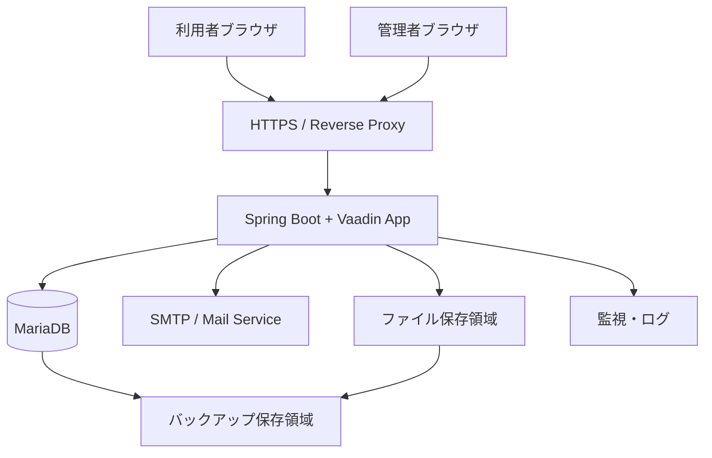

# システム構成設計

## 1. 目的

本書は、Data Center Asset & Infrastructure Manager（以下、本システム）の初期リリースにおけるシステム構成方針を定義する。

対象は、アプリケーション、データベース、メール送信、ファイル管理、バックアップ、監視、セキュリティ、環境分離である。

## 2. 前提

- 初期リリースは小規模〜中規模テナント向けのSaaSとして開始する。
- アプリケーションは Java / Spring Boot / Vaadin を前提とする。
- データベースは MariaDB を前提とする。
- マルチテナント方式は、初期リリースでは単一DB・単一スキーマ・`tenant_id` による論理分離とする。
- クラウド資産のAPI連携は将来拡張とし、初期リリースではメール通知とCSV連携を主な外部連携とする。

## 3. 初期構成案

## 4. 構成要素

| 区分 | 構成要素 | 初期方針 |
|---|---|---|
| Web / App | Spring Boot + Vaadin | 1アプリケーションとして提供する |
| DB | MariaDB | 単一DB・単一スキーマ・tenant_id分離 |
| Reverse Proxy | Nginx等 | HTTPS終端、静的配信、アクセス制御 |
| Mail | SMTP / 外部メールサービス | 保守期限通知、プラン上限警告、システム通知に利用 |
| Storage | ローカルまたはオブジェクトストレージ | CSV入出力一時ファイル、将来の添付ファイルに利用 |
| Backup | DB / ファイルバックアップ | 日次バックアップを基本とする |
| Monitoring | ログ・死活監視 | アプリログ、DB容量、バッチ失敗を監視 |

## 5. 環境構成

| 環境 | 用途 | 方針 |
|---|---|---|
| local | 開発者ローカル確認 | Docker ComposeまたはローカルMariaDBを利用 |
| dev | 開発・内部確認 | 機能確認用。テストデータを利用 |
| staging | リリース前確認 | 本番相当設定で受入確認 |
| production | 本番 | バックアップ、監視、HTTPSを必須とする |

## 6. セキュリティ方針

- 通信はHTTPSを必須とする。
- 認証情報、SMTPパスワード、DBパスワードは環境変数または秘密情報管理で扱い、ソースコードに含めない。
- テナント分離はすべての業務データ検索で `tenant_id` を必須条件とする。
- 管理者・運用者・閲覧者などのロールに基づき、画面表示とService層の両方で認可チェックを行う。
- 主要データは最低限の監査情報として作成者・作成日時・更新者・更新日時を保持する。

## 7. バックアップ方針

| 対象 | 頻度 | 保持方針 |
|---|---|---|
| MariaDB | 日次 | 初期は7〜30日保持を目安とする |
| CSV履歴・ファイル | 日次 | 必要に応じてDBバックアップと同期間保持 |
| 設定ファイル | 変更時 | 秘密情報を除き復旧可能な状態にする |

## 8. 監視方針

| 監視対象 | 内容 |
|---|---|
| アプリケーション死活 | HTTPヘルスチェック |
| DB接続 | 接続可否、容量、スロークエリ |
| バッチ | 保守期限通知、プラン上限警告、バックアップの失敗 |
| メール送信 | FAILED件数、SMTP接続失敗 |
| ディスク容量 | DB、ログ、CSV一時ファイル領域 |

## 9. 将来拡張

- アプリケーションの複数台構成
- DBリードレプリカ
- オブジェクトストレージ利用
- AWS等のクラウドAPI連携
- 監査ログ専用ストレージ
- テナント別DB分離

## 10. 後続確認事項

| 項目 | 確認内容 |
|---|---|
| 本番インフラ | VPS開始かクラウド開始か |
| バックアップ保持期間 | Free / 有料プラン別に差をつけるか |
| SMTPサービス | 利用するメール送信サービス |
| ログ保持期間 | 操作履歴・アプリログの保持期間 |
